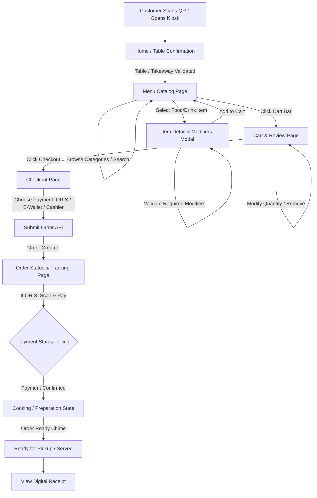

# SPECIFICATION: POS SELF-ORDERING PROGRESSIVE WEB APP (PWA)
**Platform:** Blazor Web App (.NET 10)  
**Development Paradigm:** FE-FIRST + CONTRACT-FIRST + MOCK-FIRST  
**Target Environment:** Mobile Browser (QR Scan), Tablet Kiosk, Desktop Kiosk  
**Document Status:** Ready for Frontend Implementation  

---

## 1. PROJECT OVERVIEW

### 1.1 Identitas & Tujuan Aplikasi
* **Nama Aplikasi:** POS Self-Ordering PWA (*NextGen Dine & Kiosk System*)
* **Tujuan Aplikasi:** Menyediakan antarmuka pemesanan mandiri (*self-ordering*) yang cepat, intuitif, responsif, dan dapat diandalkan bagi pelanggan restoran/kafe, baik melalui pemindaian QR di meja (smartphone pelanggan) maupun tablet/kiosk stasioner di toko, tanpa mewajibkan unduh aplikasi dari App Store / Play Store.
* **Target User:**
  1. **Pelanggan Dine-in / Takeaway:** Mengakses menu, kustomisasi pesanan (modifiers/toppings), checkout, dan pembayaran mandiri via smartphone atau kiosk.
  2. **Staff / Kasir / Kiosk Admin:** Mengatur nomor meja, mode kiosk (lock-screen pin), dan memantau status sesi perangkat.
* **Masalah yang Diselesaikan:**
  * Menghilangkan antrean panjang di kasir saat jam sibuk.
  * Mengurangi kesalahan pencatatan pesanan manual dan kustomisasi menu.
  * Memberikan pengalaman visual menu yang interaktif, cepat, dan informatif (foto, alergen, level pedas, ketersediaan stok).
  * Menghemat biaya perangkat keras khusus karena dapat berjalan di browser tablet/smartphone apapun sebagai PWA.

### 1.2 Platform & Capabilities
* **Platform Target:** Web Browser Modern (iOS Safari, Android Chrome, Edge, Chrome Desktop).
* **Alasan Menggunakan PWA:**
  * **Zero Friction:** Pelanggan tidak perlu menginstall aplikasi native melalui Play Store/App Store saat scan QR code di meja.
  * **App-like Experience:** Fullscreen standalone mode, fast loading, animasi transisi halus, dan touch-first navigation.
  * **Offline Resilience:** Aset aplikasi dan katalog menu dapat di-cache sehingga halaman tetap terbuka cepat meskipun koneksi Wi-Fi restoran mengalami instabilitas.
  * **Installable:** Tablet kiosk di restoran dapat di-"Install" ke home screen dan berjalan dalam mode kiosk fullscreen (*Standalone Mode*).
* **Device Requirements:**
  * **Mobile (Customer Phone):** Minimal resolusi 360x640px, portrait-first.
  * **Tablet (Table/Counter Kiosk):** Minimal resolusi 768x1024px, mendukung orientasi portrait dan landscape.
  * **Desktop:** Responsive wide view untuk pengujian dan display kasir.
* **Device Hardware & Browser APIs:**
  * **Camera / QR Scanner:** JS Interop (`Html5Qrcode` / Barcode Detection API) untuk scan QR meja pada mode mobile/admin.
  * **Geolocation:** `TBD` (Tidak diperlukan untuk in-store self-ordering).
  * **Push Notification / Web Notifications:** Notifikasi status pesanan siap diambil (*Order Ready notification*).
  * **Sound / Audio API:** Suara notifikasi (*order chime*) saat pesanan terkonfirmasi.
  * **Vibration API:** Haptic feedback saat menambahkan item ke keranjang dan konfirmasi checkout.
  * **Payment Integration:** QRIS dynamic barcode display, E-Wallet deeplink/redirect, Pay at Cashier option.
  * **File Upload:** `TBD` (Tidak diperlukan di sisi pelanggan).
  * **Authentication:** Session-based Anonymous Token untuk pelanggan (terikat ke Table Number / Session ID), PIN-based auth untuk Mode Kiosk / Staff.
  * **Authorization:** Role: `Customer`, `KioskAdmin`.
  * **Offline Capability:** Service Worker Cache-First untuk static assets (Wasm binaries, icons, CSS), Stale-While-Revalidate untuk Menu Catalog. Order submission membutuhkan koneksi aktif (offline queuing dengan modal warning jika jaringan terputus).

---

## 2. TECHNOLOGY STACK

### 2.1 Core Framework & Language
* **Framework:** .NET 10 (C# 14 / .NET 10 SDK)
* **Application Paradigm:** ASP.NET Core Blazor Web App
* **UI Component Engine:** Razor Components (`.razor`)
* **Styling:** Vanilla CSS3 dengan Modern CSS Variables, CSS Grid, Flexbox, Glassmorphism design tokens, dan CSS Hardware Acceleration (Smooth Transitions & Micro-animations).
* **DOM & Scripting:** C# First. JavaScript hanya digunakan secara isolatif melalui **JS Interop** (`IJSRuntime` / ES Modules) untuk browser API tertentu (Service Worker registration, QR Scanner, Audio chime, Web Vibration, localStorage interop).
* **HTTP & Serialization:**
  * `HttpClient` terdaftar via `IHttpClientFactory`
  * `System.Net.Http.Json`
  * `System.Text.Json` dengan `JsonSerializerOptions` (camelCase naming, string enum conversion)
* **Dependency Injection:** Built-in `Microsoft.Extensions.DependencyInjection`
* **PWA Engine:** Vanilla Service Worker (`service-worker.js`) + W3C Web App Manifest (`manifest.webmanifest`).

### 2.2 Library & Dependency Policy
* **Prinsip Utama:** Minimal dependency external untuk menjamin ukuran bundle WebAssembly kecil, waktu muat cepat, dan maintainability jangka panjang.
* **UI Library:** **Vanilla CSS & Custom Razor Components (No heavy UI library)**.
  * *Alasan:* Menghindari bloat, memastikan kompatibilitas native .NET 10, kontrol penuh atas visual design tokens, dan mempermudah AI Coding Agent untuk membaca/membuat styling tanpa third-party runtime issues.
* **Iconography:** SVG Icons inline atau icon pack lightweight via CSS SVG sprites (Heroicons / Lucide Icons SVG format).

---

## 3. BLAZOR APPLICATION MODEL & RENDER MODES

### 3.1 Keputusan Render Mode (.NET 10)
Aplikasi menggunakan konfigurasi **Blazor Web App dengan Interactive WebAssembly** (`InteractiveWebAssembly` / `InteractiveAuto`).

```text
┌────────────────────────────────────────────────────────┐
│                   App.razor (.NET 10)                  │
│  Routes.razor with @rendermode InteractiveWebAssembly  │
└────────────────────────────────────────────────────────┘
```

#### Alasan Pemilihan:
1. **PWA & Offline Execution:** Blazor WebAssembly berjalan langsung di runtime WebAssembly client browser. Hal ini memungkinkan UI tetap interaktif, memvalidasi form, mengelola keranjang belanja (cart), dan menampilkan katalog menu yang telah di-cache meskipun koneksi jaringan drop sementara.
2. **Kiosk Latency:** Interaksi seperti membuka modal modifiers, menambah/mengurangi kuantitas, dan kalkulasi subtotal berjalan instan (0ms network roundtrip) di sisi client.
3. **Prerendering Considerations:** Halaman awal di-prerender dari server (Static SSR) untuk First Contentful Paint (FCP) super cepat, lalu berpindah ke client-side WebAssembly interactivity secara transparan.

---

## 4. PROJECT STRUCTURE

Struktur folder terorganisir secara modular, memisahkan concern antara UI, Business Logic, Abstraction, dan Data Provider (Mock vs Real).

```text
pos-self-ordering/
├── src/
│   ├── App.razor                     # Root component
│   ├── Routes.razor                  # Router definition & route layout mappings
│   ├── _Imports.razor                # Global namespace imports
│   ├── Program.cs                    # Entry point, DI registration, configuration
│   │
│   ├── Pages/                        # Routed Razor Components (@page)
│   │   ├── Home.razor                # Welcome / Scan QR / Table Selection
│   │   ├── Menu.razor                # Catalog browsing, Category tabs & Search
│   │   ├── ItemDetailModal.razor     # Modifier & Customization selection modal
│   │   ├── Cart.razor                # Order summary & Voucher input
│   │   ├── Checkout.razor            # Customer info, Dine-in/Takeaway & Payment method
│   │   ├── OrderStatus.razor         # Real-time order progress & QR/PIN status
│   │   ├── OrderReceipt.razor        # Digital invoice / Receipt view
│   │   └── KioskSettings.razor       # Admin/Staff Kiosk configuration
│   │
│   ├── Components/                   # Reusable Visual Razor Components
│   │   ├── Layout/
│   │   │   ├── MainLayout.razor      # Top bar, Brand banner, Bottom Navigation / Cart Floater
│   │   │   ├── KioskLayout.razor     # Kiosk wide-screen layout with sticky cart column
│   │   │   └── HeaderNav.razor       # Table badge, back button, search bar toggle
│   │   ├── Common/
│   │   │   ├── LoadingSkeleton.razor # Shimmer skeleton loader
│   │   │   ├── EmptyState.razor      # Empty illustration, message, & action button
│   │   │   ├── ErrorAlert.razor      # Error banner with retry callback
│   │   │   ├── OfflineBadge.razor    # Offline banner indicator
│   │   │   ├── ModalDialog.razor     # Generic accessible modal backdrop & container
│   │   │   ├── QuantityPicker.razor  # Increment/Decrement counter component
│   │   │   └── Badge.razor           # Dietary, Spicy, or Status chip badge
│   │   ├── Menu/
│   │   │   ├── CategoryTabs.razor    # Horizontal scrollable category pill selector
│   │   │   ├── MenuItemCard.razor    # Food/Beverage item card with price & Add button
│   │   │   ├── ModifierGroup.razor   # Single-select (Radio) or Multi-select (Checkbox) group
│   │   │   └── SearchBar.razor       # Instant filter input with clear button
│   │   ├── Cart/
│   │   │   ├── CartItemRow.razor     # Item line with selected modifiers & remove trigger
│   │   │   ├── CartSummaryBar.razor  # Floating bottom bar with total items & checkout CTA
│   │   │   └── PriceBreakdown.razor  # Subtotal, Tax, Service Charge, Discount summary
│   │   └── Checkout/
│   │       ├── PaymentMethodCard.razor # Radio card for QRIS, E-Wallet, Cashier
│   │       └── QrisDisplay.razor     # Dynamic QRIS image / countdown timer
│   │
│   ├── Features/                     # Feature-specific state and logic encapsulations
│   │   ├── Session/                  # Table / Customer Session feature logic
│   │   ├── Catalog/                  # Menu & Category feature logic
│   │   ├── Cart/                     # Shopping cart calculation & modifier validation
│   │   ├── Order/                    # Order submission & status tracking
│   │   └── Payment/                  # Payment verification & polling
│   │
│   ├── Models/                       # Domain / UI Entities & Enums
│   │   ├── Enums/                    # OrderStatus, OrderType, PaymentMethod, ModifierType
│   │   ├── MenuItem.cs               # UI-specific domain representations
│   │   ├── Modifier.cs
│   │   └── CartItem.cs
│   │
│   ├── DTOs/                         # Data Transfer Objects (Request & Response contracts)
│   │   ├── Common/
│   │   │   └── ApiResponse.cs        # Unified generic API response wrapper
│   │   ├── Session/                  # InitSessionRequest, TableSessionDto
│   │   ├── Menu/                     # CategoryDto, MenuItemDto, ModifierGroupDto
│   │   ├── Cart/                     # ValidateCartRequestDto, CartValidationResultDto
│   │   ├── Order/                    # CreateOrderRequestDto, OrderDto, OrderStatusDto
│   │   └── Payment/                  # PaymentInitiateRequestDto, PaymentResultDto
│   │
│   ├── Api/                          # Generic API Abstraction & Client Implementation
│   │   ├── IApiClient.cs             # Generic interface for HTTP operations
│   │   └── ApiClient.cs              # Concrete HttpClient wrapper with error handling
│   │
│   ├── Repositories/                 # Data Access Abstraction Layer
│   │   ├── Contracts/
│   │   │   ├── ISessionRepository.cs
│   │   │   ├── IMenuRepository.cs
│   │   │   ├── IOrderRepository.cs
│   │   │   └── IPaymentRepository.cs
│   │   └── Implementations/          # Real Backend Client implementations
│   │       ├── SessionRepository.cs
│   │       ├── MenuRepository.cs
│   │       ├── OrderRepository.cs
│   │       └── PaymentRepository.cs
│   │
│   ├── Services/                     # Business Logic Layer (Invoked by UI Pages)
│   │   ├── ISessionService.cs        # Table & customer identity management
│   │   ├── IMenuService.cs           # Category & item filtering logic
│   │   ├── ICartService.cs           # Cart state management, additions, modifier check
│   │   ├── IOrderService.cs          # Order submission, validation, history
│   │   ├── IPaymentService.cs        # Payment initiation & status polling
│   │   └── INotificationService.cs   # Toast & audio chime notification
│   │
│   ├── Mocks/                        # Mock Repositories for FE-First Development
│   │   ├── MockData/                 # In-Memory Seed Data (Categories, Items, Modifiers)
│   │   │   ├── MockCategories.cs
│   │   │   ├── MockMenuItems.cs
│   │   │   └── MockOrders.cs
│   │   ├── MockSessionRepository.cs  # Simulates session init & table validation
│   │   ├── MockMenuRepository.cs     # Simulates menu query, delay & filtering
│   │   ├── MockOrderRepository.cs    # Simulates order creation & state progression
│   │   └── MockPaymentRepository.cs  # Simulates dynamic QRIS generation & payment completion
│   │
│   ├── State/                        # Global & Persistent State Containers
│   │   ├── AppState.cs               # Notification & global UI events
│   │   ├── CartState.cs              # In-memory Cart & reactive event dispatchers
│   │   └── SessionState.cs           # Active Table Number, Token, OrderType
│   │
│   ├── Validators/                   # Client-side / Form DTO Fluent & Model Validators
│   │   ├── CartItemValidator.cs
│   │   ├── CheckoutValidator.cs
│   │   └── KioskConfigValidator.cs
│   │
│   ├── Extensions/                   # Extension Methods (Currency, Enum formatting, DI)
│   │   ├── ServiceCollectionExtensions.cs # Configures Real vs Mock DI registrations
│   │   ├── NumberExtensions.cs       # IDR Currency formatting (e.g. Rp 45.000)
│   │   └── DateTimeExtensions.cs
│   │
│   ├── Utilities/                    # Helper classes (Constants, Storage Keys)
│   │   ├── AppConstants.cs
│   │   └── StorageKeys.cs
│   │
│   └── wwwroot/                      # Static Assets & PWA Engine
│       ├── css/
│       │   ├── app.css               # Design tokens, reset, typography, layouts
│       │   ├── components.css        # Component-specific styles
│       │   └── kiosk.css             # Tablet/Kiosk responsive overrides
│       ├── js/
│       │   ├── pwa-helper.js         # Service Worker registration, install prompt
│       │   ├── qr-scanner.js         # Barcode/QR camera scanning interop
│       │   ├── audio-helper.js       # Chime sound player
│       │   └── storage-helper.js     # localStorage fallback helper
│       ├── sounds/
│       │   └── order-success.mp3     # Notification sound
│       ├── icons/
│       │   ├── icon-192x192.png
│       │   ├── icon-512x512.png
│       │   └── favicon.ico
│       ├── manifest.webmanifest      # PWA App Manifest
│       ├── service-worker.js         # Production Service Worker (Cache-First + Network Fallback)
│       ├── service-worker.published.js
│       └── index.html                # Host page
```

---

## 5. PAGE VS COMPONENT RESPONSIBILITIES

```text
┌────────────────────────────────────────────────────────┐
│                   ROUTED PAGE (@page)                  │
│ • Routing & URL Parameter parsing                      │
│ • Dependency Injection of Application Services         │
│ • Page-level State Orchestration                       │
│ • Handles Loading, Empty, Error, and Offline states    │
│ • Passes Data & EventCallbacks to Children             │
└──────────────────────────┬─────────────────────────────┘
                           │ Data & EventCallbacks
                           ▼
┌────────────────────────────────────────────────────────┐
│                REUSABLE RAZOR COMPONENT                │
│ • Pure presentation & isolated UI behavior             │
│ • Parameters: [Parameter] for data input               │
│ • Output: EventCallback / EventCallback<T> for actions │
│ • Local visual state only (e.g., dropdown expanded)    │
│ • STRICT RULE: Never calls IApiClient or Http directly!│
└────────────────────────────────────────────────────────┘
```

---

## 6. LAYERED ARCHITECTURE

Semua alur data mengalir searah melalui arsitektur berlapis yang terisolasi:

```text
 [ Razor Page ] (e.g., Menu.razor)
       │
       ▼
 [ Razor Component ] (e.g., MenuItemCard.razor)
       │  (dispatches EventCallback)
       ▼
 [ Application Service ] (e.g., CartService / MenuService)
       │  (applies business rules, state mutations)
       ▼
 [ Repository Interface ] (e.g., IMenuRepository)
       │
       ├───────────────────────────────┐
       ▼                               ▼
[ MockMenuRepository ]       [ ApiMenuRepository ]
 (Development / Mock Mode)     (Production / Real Backend)
       │                               │
       ▼                               ▼
  [ In-Memory Seed ]              [ IApiClient ]
                                       │
                                       ▼
                                 [ Real API / Backend ]
```

---

## 7. PAGE SPECIFICATION

### 7.1 Page: Table Selection / Welcome (`Home.razor`)
* **Route:** `/` atau `/table/{TableNumber}`
* **Purpose:** Memulai sesi pemesanan, menentukan nomor meja (Dine-in) atau Takeaway, dan memvalidasi token sesi.
* **Authentication:** Public / Anonymous.
* **Layout:** `MainLayout.razor`
* **Components:** `HeaderNav`, `TableNumberInput`, `OrderTypeSelector`, `ErrorAlert`.
* **State:**
  * `TableNumber` (string)
  * `SelectedOrderType` (DineIn / Takeaway)
  * `CustomerName` (string, opsional)
  * `IsLoading`, `ErrorMessage`
* **API Dependency:** `POST /api/v1/sessions/init`
* **Flow & Navigation:** Setelah sesi terinisialisasi, arahkan (*navigate*) ke `/menu`.

### 7.2 Page: Menu Catalog (`Menu.razor`)
* **Route:** `/menu`
* **Purpose:** Menampilkan daftar kategori makanan/minuman, banner promosi, search bar, dan grid produk dengan harga serta tombol kustomisasi.
* **Authentication:** Active Session Required (Redirect ke `/` jika session null).
* **Layout:** `MainLayout.razor` (Mobile) / `KioskLayout.razor` (Tablet/Desktop).
* **Components:** `CategoryTabs`, `SearchBar`, `MenuItemCard`, `ItemDetailModal`, `CartSummaryBar`, `LoadingSkeleton`, `EmptyState`, `ErrorAlert`.
* **State:**
  * `Categories` (`IReadOnlyList<CategoryDto>`)
  * `SelectedCategoryId` (string)
  * `SearchQuery` (string)
  * `ActiveMenuItem` (`MenuItemDto` untuk detail modal)
  * `IsDetailModalOpen` (bool)
  * `IsLoading`, `HasError`, `IsOffline`
* **API Dependency:**
  * `GET /api/v1/menu/categories`
  * `GET /api/v1/menu/items?categoryId={id}&search={q}`
* **Responsive Behavior:** 1 Kolom (Mobile 360px), 2 Kolom (Mobile 480px), 3-4 Kolom (Tablet/Kiosk landscape).

### 7.3 Component / Modal: Item Customization Modal (`ItemDetailModal.razor`)
* **Route:** Modal overlay pada `/menu`.
* **Purpose:** Memilih varian produk (Size, Hot/Cold, Sugar Level, Extra Toppings) dan menambahkan catatan khusus (*special instructions*).
* **Components:** `ModifierGroup`, `QuantityPicker`, `PriceBreakdown`.
* **Validation:** Memastikan semua modifier dengan status `Required = true` telah dipilih sebelum tombol "Tambah ke Keranjang" aktif.

### 7.4 Page: Cart & Order Review (`Cart.razor`)
* **Route:** `/cart`
* **Purpose:** Meninjau daftar item yang dipesan, mengubah kuantitas, menghapus item, memasukkan kode voucher, dan melihat rincian biaya (Subtotal, PB1 Tax 10%, Service Charge 5%).
* **Authentication:** Active Session Required.
* **Layout:** `MainLayout.razor`
* **Components:** `CartItemRow`, `QuantityPicker`, `PriceBreakdown`, `EmptyState`.
* **API Dependency:** `POST /api/v1/cart/validate` (opsional untuk verifikasi stok terkini).
* **Navigation:** Tombol "Lanjut ke Pembayaran" mengarahkan ke `/checkout`. Tombol "Tambah Menu Lain" kembali ke `/menu`.

### 7.5 Page: Checkout & Payment Selection (`Checkout.razor`)
* **Route:** `/checkout`
* **Purpose:** Mengonfirmasi data pemesan, memilih metode pembayaran (QRIS, E-Wallet GoPay/OVO/ShopeePay, atau Bayar di Kasir), dan memproses order.
* **Authentication:** Active Session Required & Cart tidak boleh kosong.
* **Components:** `PaymentMethodCard`, `PriceBreakdown`, `ErrorAlert`.
* **API Dependency:**
  * `POST /api/v1/orders`
  * `POST /api/v1/payments/initiate`
* **Navigation:** Setelah submit berhasil, arahkan ke `/order-status/{OrderNumber}`.

### 7.6 Page: Order Status & Live Tracking (`OrderStatus.razor`)
* **Route:** `/order-status/{OrderNumber}`
* **Purpose:** Menampilkan QR code pembayaran (jika QRIS), countdown timer kadaluarsa pembayaran, status pesanan real-time (*PendingPayment -> Confirmed -> Cooking -> Ready -> Completed*), dan ringkasan pesanan.
* **Authentication:** Valid Order ID.
* **Components:** `QrisDisplay`, `Badge`, `PriceBreakdown`, `LoadingSkeleton`.
* **API Dependency:**
  * `GET /api/v1/orders/{orderNumber}`
  * `GET /api/v1/payments/{orderNumber}/status`
* **Behavior:** Polling otomatis setiap 3-5 detik saat status `PendingPayment` atau `Cooking`.

### 7.7 Page: Digital Receipt (`OrderReceipt.razor`)
* **Route:** `/receipt/{OrderNumber}`
* **Purpose:** Menampilkan struk digital resmi yang ramah cetak (*print-friendly*) dan dapat diunduh/disimpan oleh pelanggan.
* **Authentication:** Valid Order ID.

### 7.8 Page: Kiosk Admin Settings (`KioskSettings.razor`)
* **Route:** `/kiosk-settings`
* **Purpose:** Konfigurasi khusus tablet kiosk restoran (Lock Table Number, Set Kiosk Device ID, Toggle Demo Mock Mode).
* **Authentication:** PIN Protected (Default PIN: `8888`).

---

## 8. USER FLOW

### 8.1 End-to-End Self-Ordering Flow



---

## 9. COMPONENT SPECIFICATIONS

### 9.1 `MenuItemCard.razor`
* **Purpose:** Menampilkan thumbnail produk, nama, badge (Best Seller, Pedas, Habis), harga dasar, dan tombol "Tambah".
* **Parameters:**
  ```csharp
  [Parameter, EditorRequired] public MenuItemDto Item { get; set; } = default!;
  [Parameter] public EventCallback<MenuItemDto> OnSelect { get; set; }
  ```
* **States:** Available, Sold Out (Disabled), Skeleton Loading.

### 9.2 `ModifierGroup.razor`
* **Purpose:** Menampilkan grup modifier (contoh: Level Pedas, Pilihan Topping, Ukuran Minuman).
* **Parameters:**
  ```csharp
  [Parameter, EditorRequired] public ModifierGroupDto Group { get; set; } = default!;
  [Parameter] public List<string> SelectedModifierIds { get; set; } = new();
  [Parameter] public EventCallback<List<string>> SelectedModifierIdsChanged { get; set; }
  ```
* **Validation:** Memastikan `MinSelections` dan `MaxSelections` terpenuhi.

### 9.3 `QuantityPicker.razor`
* **Purpose:** Counter tombol plus minus dengan batas minimum dan maksimum.
* **Parameters:**
  ```csharp
  [Parameter] public int Value { get; set; } = 1;
  [Parameter] public int MinValue { get; set; } = 1;
  [Parameter] public int MaxValue { get; set; } = 99;
  [Parameter] public EventCallback<int> ValueChanged { get; set; }
  ```

### 9.4 `QrisDisplay.razor`
* **Purpose:** Menampilkan QR Code QRIS dinamis, batas waktu pembayaran (*countdown timer*), dan instruksi pembayaran.
* **Parameters:**
  ```csharp
  [Parameter, EditorRequired] public string QrString { get; set; } = string.Empty;
  [Parameter, EditorRequired] public decimal Amount { get; set; }
  [Parameter] public DateTime ExpiresAtUtc { get; set; }
  [Parameter] public EventCallback OnExpired { get; set; }
  ```

### 9.5 `PriceBreakdown.razor`
* **Purpose:** Menghitung dan merender rincian subtotal, diskon voucher, pajak PB1 10%, dan biaya layanan 5%.
* **Parameters:**
  ```csharp
  [Parameter] public decimal Subtotal { get; set; }
  [Parameter] public decimal Discount { get; set; }
  [Parameter] public decimal TaxRate { get; set; } = 0.10m;
  [Parameter] public decimal ServiceChargeRate { get; set; } = 0.05m;
  ```

---

## 10. STATE MANAGEMENT

### 10.1 Taksonomi State Aplikasi

```text
┌──────────────────┬─────────────────────────────────────┬───────────────────────────┐
│ State Type       │ Deskripsi & Cakupan                 │ Mekanisme Penyimpanan     │
├──────────────────┼─────────────────────────────────────┼───────────────────────────┤
│ Local State      │ State visual internal komponen      │ C# Component Fields       │
│                  │ (misal: modal isOpen, search text)  │                           │
├──────────────────┼─────────────────────────────────────┼───────────────────────────┤
│ Page State       │ State lifecycle selama di page      │ C# Page Fields            │
│                  │ (misal: selectedCategoryId)         │                           │
├──────────────────┼─────────────────────────────────────┼───────────────────────────┤
│ Application State│ State global reaktif lintas halaman │ In-Memory Scoped Services │
│                  │ (Cart items, Active Session, Toasts)│ (CartState, SessionState) │
├──────────────────┼─────────────────────────────────────┼───────────────────────────┤
│ Server State     │ Data master dari API (Menu, Status) │ Repository & Memory Cache │
├──────────────────┼─────────────────────────────────────┼───────────────────────────┤
│ Persistent State │ Data yang bertahan saat refresh/PWA │ Browser `localStorage` /  │
│                  │ (Session Token, Kiosk Config)       │ `sessionStorage`          │
└──────────────────┴─────────────────────────────────────┴───────────────────────────┘
```

### 10.2 CartState Architecture (Reactive Pattern)
```csharp
public sealed class CartState
{
    private readonly List<CartItem> _items = new();
    public IReadOnlyList<CartItem> Items => _items.AsReadOnly();
    
    public event Action? OnChange;

    public void AddItem(MenuItemDto item, List<ModifierDto> selectedModifiers, int quantity, string notes)
    {
        // Business logic to check existing item with same modifiers
        var existing = _items.FirstOrDefault(x => x.IsSameConfiguration(item.Id, selectedModifiers, notes));
        if (existing is not null)
        {
            existing.Quantity += quantity;
        }
        else
        {
            _items.Add(new CartItem(Guid.NewGuid().ToString(), item, selectedModifiers, quantity, notes));
        }
        NotifyStateChanged();
    }

    public void UpdateQuantity(string cartItemId, int newQty)
    {
        var item = _items.FirstOrDefault(x => x.CartItemId == cartItemId);
        if (item is null) return;
        
        if (newQty <= 0)
            _items.Remove(item);
        else
            item.Quantity = newQty;
            
        NotifyStateChanged();
    }

    public void Clear()
    {
        _items.Clear();
        NotifyStateChanged();
    }

    public decimal Subtotal => _items.Sum(i => i.TotalPrice);
    public decimal Tax => Subtotal * 0.10m;
    public decimal ServiceCharge => Subtotal * 0.05m;
    public decimal GrandTotal => Subtotal + Tax + ServiceCharge;
    public int TotalItemCount => _items.Sum(i => i.Quantity);

    private void NotifyStateChanged() => OnChange?.Invoke();
}
```

---

## 11. UNIFIED API CONTRACT

Frontend menentukan kontrak response JSON standar:

```json
{
  "success": true,
  "statusCode": 200,
  "message": "Operation successful",
  "data": {},
  "errors": []
}
```

### 11.1 Endpoint Catalog

```text
========================================================================================
1. SESSION ENDPOINTS
========================================================================================
POST /api/v1/sessions/init
Purpose: Inisialisasi sesi meja atau kiosk
Auth: None
Request Body:
{
  "tableNumber": "T-05",
  "orderType": "DineIn", // DineIn | Takeaway
  "customerName": "John Doe",
  "deviceIdentifier": "kiosk-tab-01"
}
Response 200 OK:
{
  "success": true,
  "statusCode": 200,
  "message": "Session initialized",
  "data": {
    "sessionId": "sess_89a1c72",
    "token": "jwt_token_sample",
    "tableNumber": "T-05",
    "orderType": "DineIn",
    "storeName": "Kopi Nusantara - Senopati",
    "expiresAtUtc": "2026-08-14T23:59:59Z"
  },
  "errors": []
}

========================================================================================
2. MENU & CATEGORY ENDPOINTS
========================================================================================
GET /api/v1/menu/categories
Purpose: Mengambil semua kategori menu aktif
Auth: Bearer Token / Session
Response 200 OK:
{
  "success": true,
  "statusCode": 200,
  "message": "Categories retrieved",
  "data": [
    {
      "id": "cat_coffee",
      "name": "Coffee & Espresso",
      "displayOrder": 1,
      "iconUrl": "/icons/coffee.svg",
      "itemCount": 12
    },
    {
      "id": "cat_non_coffee",
      "name": "Non-Coffee & Artisan Tea",
      "displayOrder": 2,
      "iconUrl": "/icons/tea.svg",
      "itemCount": 8
    },
    {
      "id": "cat_food",
      "name": "Main Course & Bites",
      "displayOrder": 3,
      "iconUrl": "/icons/food.svg",
      "itemCount": 15
    }
  ],
  "errors": []
}

GET /api/v1/menu/items?categoryId={categoryId}&search={search}
Purpose: Mengambil daftar menu berdasarkan filter
Auth: Bearer Token / Session
Response 200 OK:
{
  "success": true,
  "statusCode": 200,
  "message": "Menu items retrieved",
  "data": [
    {
      "id": "item_kopi_susu",
      "categoryId": "cat_coffee",
      "name": "Kopi Susu Gula Aren",
      "description": "Espresso blend spesial dipadukan susu segar dan gula aren murni.",
      "basePrice": 25000,
      "imageUrl": "/images/menu/kopi-susu.webp",
      "isAvailable": true,
      "isBestSeller": true,
      "isSpicy": false,
      "modifierGroups": [
        {
          "id": "mod_size",
          "name": "Pilih Ukuran",
          "isRequired": true,
          "minSelections": 1,
          "maxSelections": 1,
          "options": [
            { "id": "opt_reg", "name": "Regular (12oz)", "extraPrice": 0, "isDefault": true },
            { "id": "opt_lrg", "name": "Large (16oz)", "extraPrice": 6000, "isDefault": false }
          ]
        },
        {
          "id": "mod_ice",
          "name": "Level Es",
          "isRequired": true,
          "minSelections": 1,
          "maxSelections": 1,
          "options": [
            { "id": "opt_ice_normal", "name": "Normal Ice", "extraPrice": 0, "isDefault": true },
            { "id": "opt_ice_less", "name": "Less Ice", "extraPrice": 0, "isDefault": false },
            { "id": "opt_ice_none", "name": "No Ice", "extraPrice": 0, "isDefault": false }
          ]
        },
        {
          "id": "mod_toppings",
          "name": "Tambahan Topping",
          "isRequired": false,
          "minSelections": 0,
          "maxSelections": 3,
          "options": [
            { "id": "opt_top_grassjelly", "name": "Grass Jelly", "extraPrice": 4000, "isDefault": false },
            { "id": "opt_top_espresso", "name": "Extra Shot Espresso", "extraPrice": 7000, "isDefault": false }
          ]
        }
      ]
    }
  ],
  "errors": []
}

========================================================================================
3. ORDER ENDPOINTS
========================================================================================
POST /api/v1/orders
Purpose: Membuat pesanan baru dari keranjang
Auth: Bearer Token / Session
Request Body:
{
  "sessionId": "sess_89a1c72",
  "tableNumber": "T-05",
  "orderType": "DineIn",
  "customerName": "John Doe",
  "customerNotes": "Jangan terlalu manis",
  "paymentMethod": "QRIS", // QRIS | Gopay | ShopeePay | Cashier
  "items": [
    {
      "menuItemId": "item_kopi_susu",
      "quantity": 2,
      "unitPrice": 25000,
      "notes": "Less sugar",
      "selectedOptionIds": ["opt_reg", "opt_ice_less", "opt_top_grassjelly"]
    }
  ]
}
Response 201 Created:
{
  "success": true,
  "statusCode": 201,
  "message": "Order created successfully",
  "data": {
    "orderNumber": "ORD-20260814-0042",
    "sessionId": "sess_89a1c72",
    "tableNumber": "T-05",
    "orderType": "DineIn",
    "customerName": "John Doe",
    "status": "PendingPayment", // PendingPayment | Confirmed | Cooking | Ready | Completed | Cancelled
    "subtotal": 58000,
    "taxAmount": 5800,
    "serviceCharge": 2900,
    "grandTotal": 66700,
    "paymentMethod": "QRIS",
    "paymentDetails": {
      "paymentId": "pay_qris_99182",
      "qrString": "00020101021226580016ID.CO.QRIS.WWW0118936009180000010042520454995802ID5914KOPI NUSANTARA6007JAKARTA61051219062070703A016304E8A2",
      "expiresAtUtc": "2026-08-14T23:15:00Z"
    },
    "createdAtUtc": "2026-08-14T23:00:00Z"
  },
  "errors": []
}

GET /api/v1/orders/{orderNumber}
Purpose: Mengambil status pesanan terkini (Polling)
Auth: Bearer Token / Session
Response 200 OK:
{
  "success": true,
  "statusCode": 200,
  "message": "Order details retrieved",
  "data": {
    "orderNumber": "ORD-20260814-0042",
    "status": "Cooking",
    "queueNumber": "A-12",
    "estimatedMinutesRemaining": 8,
    "paidAtUtc": "2026-08-14T23:02:15Z",
    "items": [
      {
        "name": "Kopi Susu Gula Aren",
        "quantity": 2,
        "selectedModifiersSummary": "Regular, Less Ice, Grass Jelly",
        "subtotal": 58000
      }
    ],
    "grandTotal": 66700
  },
  "errors": []
}

========================================================================================
4. PAYMENT ENDPOINTS
========================================================================================
GET /api/v1/payments/{orderNumber}/status
Purpose: Mengecek status pelunasan pembayaran
Auth: Bearer Token / Session
Response 200 OK:
{
  "success": true,
  "statusCode": 200,
  "message": "Payment status verified",
  "data": {
    "orderNumber": "ORD-20260814-0042",
    "isPaid": true,
    "paymentStatus": "Success", // Pending | Success | Expired | Failed
    "transactionId": "trx_midtrans_99182312",
    "paidAtUtc": "2026-08-14T23:02:15Z"
  },
  "errors": []
}
```

---

## 12. C# REQUEST / RESPONSE DTO MODELS

Semua DTO ditulis menggunakan C# immutable `record` dengan *nullable reference types* dan tanpa `dynamic`/`object`.

```csharp
namespace PosSelfOrdering.DTOs.Common;

public sealed record ApiResponse<T>(
    bool Success,
    int StatusCode,
    string Message,
    T? Data,
    IReadOnlyList<string>? Errors = null
)
{
    public static ApiResponse<T> Ok(T data, string message = "Success") =>
        new(true, 200, message, data, Array.Empty<string>());

    public static ApiResponse<T> Fail(string message, int statusCode = 400, IReadOnlyList<string>? errors = null) =>
        new(false, statusCode, message, default, errors ?? new[] { message });
}
```

```csharp
namespace PosSelfOrdering.DTOs.Session;

public sealed record InitSessionRequest(
    string TableNumber,
    string OrderType,
    string? CustomerName = null,
    string? DeviceIdentifier = null
);

public sealed record TableSessionDto(
    string SessionId,
    string Token,
    string TableNumber,
    string OrderType,
    string StoreName,
    DateTime ExpiresAtUtc
);
```

```csharp
namespace PosSelfOrdering.DTOs.Menu;

public sealed record CategoryDto(
    string Id,
    string Name,
    int DisplayOrder,
    string IconUrl,
    int ItemCount
);

public sealed record ModifierOptionDto(
    string Id,
    string Name,
    decimal ExtraPrice,
    bool IsDefault
);

public sealed record ModifierGroupDto(
    string Id,
    string Name,
    bool IsRequired,
    int MinSelections,
    int MaxSelections,
    IReadOnlyList<ModifierOptionDto> Options
);

public sealed record MenuItemDto(
    string Id,
    string CategoryId,
    string Name,
    string Description,
    decimal BasePrice,
    string ImageUrl,
    bool IsAvailable,
    bool IsBestSeller,
    bool IsSpicy,
    IReadOnlyList<ModifierGroupDto> ModifierGroups
);
```

```csharp
namespace PosSelfOrdering.DTOs.Order;

public sealed record OrderItemRequestDto(
    string MenuItemId,
    int Quantity,
    decimal UnitPrice,
    string? Notes,
    IReadOnlyList<string> SelectedOptionIds
);

public sealed record CreateOrderRequestDto(
    string SessionId,
    string TableNumber,
    string OrderType,
    string? CustomerName,
    string? CustomerNotes,
    string PaymentMethod,
    IReadOnlyList<OrderItemRequestDto> Items
);

public sealed record PaymentDetailsDto(
    string PaymentId,
    string QrString,
    DateTime ExpiresAtUtc
);

public sealed record OrderDto(
    string OrderNumber,
    string SessionId,
    string TableNumber,
    string OrderType,
    string? CustomerName,
    string Status,
    decimal Subtotal,
    decimal TaxAmount,
    decimal ServiceCharge,
    decimal GrandTotal,
    string PaymentMethod,
    PaymentDetailsDto? PaymentDetails,
    DateTime CreatedAtUtc
);

public sealed record OrderStatusItemDto(
    string Name,
    int Quantity,
    string SelectedModifiersSummary,
    decimal Subtotal
);

public sealed record OrderStatusDto(
    string OrderNumber,
    string Status,
    string QueueNumber,
    int EstimatedMinutesRemaining,
    DateTime? PaidAtUtc,
    IReadOnlyList<OrderStatusItemDto> Items,
    decimal GrandTotal
);
```

```csharp
namespace PosSelfOrdering.DTOs.Payment;

public sealed record PaymentStatusDto(
    string OrderNumber,
    bool IsPaid,
    string PaymentStatus,
    string? TransactionId,
    DateTime? PaidAtUtc
);
```

---

## 13. API CLIENT ABSTRACTION

```csharp
namespace PosSelfOrdering.Api;

public interface IApiClient
{
    Task<ApiResponse<TResponse>?> GetAsync<TResponse>(string endpoint, CancellationToken ct = default);
    Task<ApiResponse<TResponse>?> PostAsync<TRequest, TResponse>(string endpoint, TRequest request, CancellationToken ct = default);
}
```

### Implementasi `ApiClient.cs`
Bertanggung jawab atas:
1. Menambahkan Session/Bearer Token ke Authorization Header.
2. Serialisasi JSON dengan camelCase naming convention.
3. Menangani Timeout dan HttpRequestException menjadi `ApiResponse<T>.Fail`.
4. Meneruskan CancellationToken untuk mencegah memory leak saat user navigasi cepat.

---

## 14. SERVICE LAYER

### `ISessionService.cs`
```csharp
public interface ISessionService
{
    TableSessionDto? CurrentSession { get; }
    bool HasActiveSession { get; }
    Task<bool> InitializeSessionAsync(string tableNumber, string orderType, string? customerName);
    Task ClearSessionAsync();
}
```

### `IMenuService.cs`
```csharp
public interface IMenuService
{
    Task<IReadOnlyList<CategoryDto>> GetCategoriesAsync(CancellationToken ct = default);
    Task<IReadOnlyList<MenuItemDto>> GetMenuItemsAsync(string? categoryId, string? searchQuery, CancellationToken ct = default);
    Task<MenuItemDto?> GetMenuItemByIdAsync(string id, CancellationToken ct = default);
}
```

### `ICartService.cs`
```csharp
public interface ICartService
{
    CartState State { get; }
    void AddItem(MenuItemDto item, IReadOnlyList<ModifierOptionDto> options, int quantity, string notes);
    void UpdateQuantity(string cartItemId, int newQty);
    void RemoveItem(string cartItemId);
    void ClearCart();
}
```

### `IOrderService.cs`
```csharp
public interface IOrderService
{
    Task<ApiResponse<OrderDto>> SubmitOrderAsync(string paymentMethod, string? customerNotes, CancellationToken ct = default);
    Task<ApiResponse<OrderStatusDto>> GetOrderStatusAsync(string orderNumber, CancellationToken ct = default);
}
```

### `IPaymentService.cs`
```csharp
public interface IPaymentService
{
    Task<ApiResponse<PaymentStatusDto>> CheckPaymentStatusAsync(string orderNumber, CancellationToken ct = default);
}
```

---

## 15. REPOSITORY ABSTRACTION

```csharp
namespace PosSelfOrdering.Repositories.Contracts;

public interface ISessionRepository
{
    Task<ApiResponse<TableSessionDto>> InitSessionAsync(InitSessionRequest request, CancellationToken ct = default);
}

public interface IMenuRepository
{
    Task<ApiResponse<IReadOnlyList<CategoryDto>>> GetCategoriesAsync(CancellationToken ct = default);
    Task<ApiResponse<IReadOnlyList<MenuItemDto>>> GetMenuItemsAsync(string? categoryId, string? search, CancellationToken ct = default);
    Task<ApiResponse<MenuItemDto>> GetMenuItemByIdAsync(string id, CancellationToken ct = default);
}

public interface IOrderRepository
{
    Task<ApiResponse<OrderDto>> CreateOrderAsync(CreateOrderRequestDto request, CancellationToken ct = default);
    Task<ApiResponse<OrderStatusDto>> GetOrderStatusAsync(string orderNumber, CancellationToken ct = default);
}

public interface IPaymentRepository
{
    Task<ApiResponse<PaymentStatusDto>> GetPaymentStatusAsync(string orderNumber, CancellationToken ct = default);
}
```

---

## 16. MOCK REPOSITORIES & SEED DATA ENGINE

Setiap repository memiliki implementasi `Mock*Repository` yang mensimulasikan network delay, kondisi loading, serta skenario error:

```csharp
namespace PosSelfOrdering.Mocks;

public sealed class MockMenuRepository : IMenuRepository
{
    public async Task<ApiResponse<IReadOnlyList<CategoryDto>>> GetCategoriesAsync(CancellationToken ct = default)
    {
        await Task.Delay(400, ct); // Simulate network latency
        return ApiResponse<IReadOnlyList<CategoryDto>>.Ok(MockCategories.All);
    }

    public async Task<ApiResponse<IReadOnlyList<MenuItemDto>>> GetMenuItemsAsync(string? categoryId, string? search, CancellationToken ct = default)
    {
        await Task.Delay(500, ct);
        
        var query = MockMenuItems.All.AsEnumerable();
        
        if (!string.IsNullOrWhiteSpace(categoryId))
            query = query.Where(x => x.CategoryId.Equals(categoryId, StringComparison.OrdinalIgnoreCase));
            
        if (!string.IsNullOrWhiteSpace(search))
            query = query.Where(x => x.Name.Contains(search, StringComparison.OrdinalIgnoreCase) ||
                                     x.Description.Contains(search, StringComparison.OrdinalIgnoreCase));
                                     
        return ApiResponse<IReadOnlyList<MenuItemDto>>.Ok(query.ToList());
    }

    public async Task<ApiResponse<MenuItemDto>> GetMenuItemByIdAsync(string id, CancellationToken ct = default)
    {
        await Task.Delay(200, ct);
        var item = MockMenuItems.All.FirstOrDefault(x => x.Id == id);
        return item is not null 
            ? ApiResponse<MenuItemDto>.Ok(item) 
            : ApiResponse<MenuItemDto>.Fail("Menu item not found", 404);
    }
}
```

```csharp
namespace PosSelfOrdering.Mocks;

public sealed class MockOrderRepository : IOrderRepository
{
    private static readonly ConcurrentDictionary<string, OrderDto> _orders = new();
    private static int _orderSeq = 100;

    public async Task<ApiResponse<OrderDto>> CreateOrderAsync(CreateOrderRequestDto request, CancellationToken ct = default)
    {
        await Task.Delay(800, ct);
        
        var orderNumber = $"ORD-{DateTime.UtcNow:yyyyMMdd}-{Interlocked.Increment(ref _orderSeq)}";
        var subtotal = request.Items.Sum(i => i.UnitPrice * i.Quantity);
        var tax = subtotal * 0.10m;
        var service = subtotal * 0.05m;
        var grandTotal = subtotal + tax + service;

        var order = new OrderDto(
            orderNumber,
            request.SessionId,
            request.TableNumber,
            request.OrderType,
            request.CustomerName,
            "PendingPayment",
            subtotal,
            tax,
            service,
            grandTotal,
            request.PaymentMethod,
            new PaymentDetailsDto(
                $"pay_{Guid.NewGuid():N}",
                "00020101021226580016ID.CO.QRIS.WWW0118936009180000010042520454995802ID5914KOPI NUSANTARA6007JAKARTA61051219062070703A016304E8A2",
                DateTime.UtcNow.AddMinutes(15)
            ),
            DateTime.UtcNow
        );

        _orders[orderNumber] = order;
        return ApiResponse<OrderDto>.Ok(order, "Order created successfully");
    }

    public async Task<ApiResponse<OrderStatusDto>> GetOrderStatusAsync(string orderNumber, CancellationToken ct = default)
    {
        await Task.Delay(300, ct);
        
        if (!_orders.TryGetValue(orderNumber, out var order))
        {
            return ApiResponse<OrderStatusDto>.Fail("Order not found", 404);
        }

        // Simulate order status progression based on time elapsed
        var elapsed = (DateTime.UtcNow - order.CreatedAtUtc).TotalSeconds;
        var simulatedStatus = elapsed switch
        {
            < 10 => "PendingPayment",
            < 25 => "Cooking",
            < 45 => "Ready",
            _ => "Completed"
        };

        var statusDto = new OrderStatusDto(
            order.OrderNumber,
            simulatedStatus,
            $"A-{(order.GrandTotal % 50) + 1:00}",
            Math.Max(0, 10 - (int)(elapsed / 6)),
            DateTime.UtcNow.AddSeconds(-elapsed),
            order.PaymentDetails is not null ? new List<OrderStatusItemDto> {
                new("Pesanan Simulasi", 1, "Standard", order.Subtotal)
            } : Array.Empty<OrderStatusItemDto>(),
            order.GrandTotal
        );

        return ApiResponse<OrderStatusDto>.Ok(statusDto);
    }
}
```

---

## 17. CONFIGURATION & DI SWITCH

### `appsettings.json`
```json
{
  "ApiSettings": {
    "BaseUrl": "https://api.pos.example.com",
    "UseMock": true,
    "SimulateLatencyMs": 500
  },
  "StoreSettings": {
    "StoreName": "Kopi Nusantara - Flagship Senopati",
    "DefaultTaxRate": 0.10,
    "DefaultServiceChargeRate": 0.05,
    "CurrencySymbol": "Rp"
  }
}
```

### `ServiceCollectionExtensions.cs`
```csharp
public static class ServiceCollectionExtensions
{
    public static IServiceCollection AddPosServices(this IServiceCollection services, IConfiguration config)
    {
        var useMock = config.GetValue<bool>("ApiSettings:UseMock", true);

        if (useMock)
        {
            services.AddSingleton<ISessionRepository, MockSessionRepository>();
            services.AddSingleton<IMenuRepository, MockMenuRepository>();
            services.AddSingleton<IOrderRepository, MockOrderRepository>();
            services.AddSingleton<IPaymentRepository, MockPaymentRepository>();
        }
        else
        {
            services.AddHttpClient<IApiClient, ApiClient>(client =>
            {
                client.BaseAddress = new Uri(config["ApiSettings:BaseUrl"]!);
                client.Timeout = TimeSpan.FromSeconds(15);
            });
            services.AddScoped<ISessionRepository, SessionRepository>();
            services.AddScoped<IMenuRepository, MenuRepository>();
            services.AddScoped<IOrderRepository, OrderRepository>();
            services.AddScoped<IPaymentRepository, PaymentRepository>();
        }

        // Domain State & Services
        services.AddScoped<CartState>();
        services.AddScoped<SessionState>();
        services.AddScoped<ISessionService, SessionService>();
        services.AddScoped<IMenuService, MenuService>();
        services.AddScoped<ICartService, CartService>();
        services.AddScoped<IOrderService, OrderService>();
        services.AddScoped<IPaymentService, PaymentService>();

        return services;
    }
}
```

---

## 18. AUTHENTICATION & KIOSK SECURITY
* **Customer Ordering:** Session Token tanpa password (stateless session ID yang di-sign oleh backend / mock). Disimpan di memory `SessionState` dan sinkron ke `sessionStorage`.
* **Kiosk Admin:** PIN Modal (6 digit PIN). Menghindari pelanggan iseng mengganti nomor meja pada perangkat kiosk tablet di meja/kasir.

---

## 19. PROGRESSIVE WEB APP (PWA) SPECIFICATION

### 19.1 `manifest.webmanifest`
```json
{
  "name": "POS Self-Ordering Kiosk",
  "short_name": "SelfOrder",
  "description": "Pesan makanan & minuman langsung dari meja secara cepat dan mudah.",
  "start_url": "/",
  "display": "standalone",
  "orientation": "portrait-primary",
  "background_color": "#0f172a",
  "theme_color": "#f59e0b",
  "icons": [
    {
      "src": "icons/icon-192x192.png",
      "sizes": "192x192",
      "type": "image/png",
      "purpose": "any maskable"
    },
    {
      "src": "icons/icon-512x512.png",
      "sizes": "512x512",
      "type": "image/png",
      "purpose": "any maskable"
    }
  ]
}
```

### 19.2 Service Worker Strategy (`service-worker.js`)
* **Static Assets (WASM, CSS, JS, Fonts, Icons):** **Cache-First Strategy**. Aset di-cache saat install event.
* **Menu Data & Images:** **Stale-While-Revalidate Strategy**. Menampilkan menu dari cache seketika, lalu memperbarui data di background saat koneksi tersedia.
* **Order & Payment Submission:** **Network-Only**. Tidak boleh di-cache untuk menghindari duplicate order placement.

---

## 20. OFFLINE CAPABILITY & RESILIENCE
* Saat jaringan terputus (`navigator.onLine == false`):
  1. Komponen `OfflineBadge.razor` otomatis muncul di bagian atas layar.
  2. Pengguna tetap dapat melihat katalog menu dan memodifikasi isi keranjang.
  3. Saat tombol "Lanjut ke Pembayaran" ditekan, modal pemberitahuan muncul: *"Koneksi terputus. Silakan hubungkan kembali ke Wi-Fi restoran untuk memproses pesanan."*

---

## 21. LOADING, EMPTY, ERROR, & OFFLINE STATES

Setiap halaman yang mengambil data asynchronous menerapkan standar 5 state:

```razor
@if (IsLoading)
{
    <LoadingSkeleton Count="6" />
}
else if (HasError)
{
    <ErrorAlert Message="@ErrorMessage" OnRetry="LoadDataAsync" />
}
else if (Items == null || !Items.Any())
{
    <EmptyState Title="Menu Tidak Ditemukan"
                Description="Tidak ada item yang sesuai dengan pencarian Anda."
                ActionText="Lihat Semua Menu"
                OnAction="ResetFilters" />
}
else
{
    <div class="menu-grid">
        @foreach (var item in Items)
        {
            <MenuItemCard Item="item" OnSelect="HandleItemSelect" />
        }
    </div>
}
```

---

## 22. FORM SPECIFICATIONS & VALIDATIONS

### 22.1 Modifier Selection Form
* **Aturan:**
  * Radio Group untuk modifier `Required = true` & `MaxSelections = 1`.
  * Checkbox Group untuk modifier `MaxSelections > 1`.
  * Tombol `Tambah ke Keranjang` dinonaktifkan (`disabled`) jika kondisi `MinSelections` pada grup yang `Required` belum terpenuhi.

### 22.2 Checkout Form
* **Field:**
  * `CustomerName`: String, Max 50 karakter, Opsional.
  * `CustomerNotes`: String, Max 150 karakter, Opsional.
  * `PaymentMethod`: Enum (Required).

---

## 23. RESPONSIVE DESIGN & VISUAL DESIGN TOKENS

### 23.1 CSS Design Tokens (`wwwroot/css/app.css`)
```css
:root {
  /* Brand Palette */
  --color-primary: #f59e0b;        /* Warm Amber */
  --color-primary-hover: #d97706;
  --color-primary-light: #fef3c7;
  
  /* Dark Mode Surfaces */
  --bg-app: #0f172a;               /* Slate 900 */
  --bg-surface: #1e293b;           /* Slate 800 */
  --bg-surface-elevated: #334155;  /* Slate 700 */
  --border-subtle: #334155;
  
  /* Typography */
  --text-primary: #f8fafc;
  --text-secondary: #94a3b8;
  --text-muted: #64748b;
  
  /* Status Colors */
  --color-success: #10b981;
  --color-danger: #ef4444;
  --color-warning: #f59e0b;
  
  /* Radius & Shadows */
  --radius-sm: 6px;
  --radius-md: 12px;
  --radius-lg: 20px;
  --radius-full: 9999px;
  --shadow-card: 0 4px 20px -2px rgba(0, 0, 0, 0.5);
  --shadow-floating: 0 10px 30px -5px rgba(245, 158, 11, 0.3);
  
  /* Touch target */
  --min-touch-target: 48px;
}
```

### 23.2 Responsive Breakpoints
* **Mobile (< 768px):** Bottom sticky cart floater, single/two-column item cards, drawer-style bottom sheet for modifiers.
* **Tablet / Kiosk (768px - 1199px):** Split-screen layout (Katalog di sisi kiri, Sticky Order Summary di sisi kanan).
* **Desktop Kiosk (>= 1200px):** 4-column menu cards, fixed side cart, prominent order type selector.

---

## 24. ACCESSIBILITY (A11Y)
* Minimum touch target untuk semua tombol: **48px x 48px**.
* Contrast ratio teks terhadap background: Minimal **4.5:1** (WCAG AA).
* Dukungan keyboard navigation pada dialog modal dan tombol quantity counter (`aria-label`, `role="dialog"`, `aria-modal="true"`).

---

## 25. JAVASCRIPT INTEROP SPECIFICATION

Hanya digunakan untuk browser API spesifik:
1. `pwaHelper.registerServiceWorker()`: Pendaftaran SW dan trigger event `beforeinstallprompt`.
2. `audioHelper.playOrderChime()`: Memutar audio `order-success.mp3` saat order berstatus Ready/Paid.
3. `pwaHelper.triggerVibrate(int ms)`: Mengaktifkan haptic feedback pada smartphone saat item ditambahkan ke cart.
4. `qrScanner.start(elementId, dotNetRef)`: Membuka kamera untuk scan QR Meja pada mode admin.

---

## 26. SECURITY GUIDELINES
* **No Secret Storage:** Tidak ada API key sensitif atau credentials yang disimpan di frontend code.
* **Input Sanitization:** Semua input teks (catatan pesanan, nama pemesan) di-escape secara default oleh Razor engine untuk mencegah XSS.
* **HTTPS Requirement:** Wajib dijalankan di atas protokol HTTPS untuk mengaktifkan Service Worker dan Camera Scanner API.

---

## 27. TESTING STRATEGY

### 27.1 Unit & State Tests
* Test `CartState`: Penambahan item dengan modifier identik vs modifier berbeda, kalkulasi pajak, service charge, dan kuantitas minimum.
* Test `MockOrderRepository`: Perubahan status pesanan berdasarkan waktu simulasi.

### 27.2 Component Tests (bUnit)
* `MenuItemCard`: Render harga IDR dengan benar, disable tombol saat `isAvailable == false`.
* `ModifierGroup`: Memastikan checkbox disabled saat `MaxSelections` tercapai.

---

## 28. PERFORMANCE TARGETS
* **Initial WASM Load (Brotli compressed):** < 2.5 MB.
* **Time To Interactive (TTI):** < 1.8 detik pada jaringan 4G standar.
* **Frame Rate:** 60 FPS untuk scrolling katalog dan animasi modal.

---

## 29. DEFINITION OF DONE (DOD) FOR FRONTEND
Sebuah fitur dinyatakan selesai jika:
1. Razor Component / Page terimplementasi tanpa direct `HttpClient` call.
2. DTO Request & Response terdefinisi lengkap dengan C# records.
3. Mock repository berjalan penuh dengan simulasi delay dan mock data realistis.
4. 5 State (Loading, Success, Empty, Error, Offline) terakomodasi di UI.
5. Responsif pada resolusi 360px (Smartphone) hingga 1024px+ (Kiosk Tablet).
6. Tidak ada hardcoded business logic di dalam Razor markup.
7. Build clean tanpa warning atau error compiler .NET 10.

---

## 30. AI CODING AGENT RULES (MANDATORY INSTRUCTIONS)

1. **Wajib membaca `spec.md`** sebelum membuat atau mengedit kode.
2. **Strictly FE-First & Mock-First:** Jangan membuat database, backend API controller ASP.NET Core, atau Entity Framework DbContext.
3. **Strictly Blazor Web App & Razor:** Gunakan file `.razor` untuk UI dan C# untuk logic. Dilarang menggunakan React, Vue, Angular, atau Razor Pages `.cshtml`.
4. **Clean Architecture:** Selalu ikuti pemisahan: `Page -> Component -> Service -> Repository -> ApiClient / Mock`.
5. **No Direct HTTP in Components:** Komponen UI tidak boleh menginjeksi `HttpClient`. Selalu melalui Service & Repository layer.
6. **Strict Types:** Gunakan C# `record` / `class` dengan *nullable reference types*. Dilarang menggunakan `dynamic` atau `object` jika tipe datanya dapat ditentukan.
7. **Mock Dependency Injection:** Seluruh mock didaftarkan via `IServiceCollection` sehingga siap diganti real API hanya dengan konfigurasi `UseMock = false`.
8. **Never Invent Business Rules:** Jika ada hal yang belum tertera di spesifikasi, tandai sebagai `TBD` dan cantumkan pada daftar Open Questions.

---

## 31. BACKEND HANDOFF CONTRACT SPECIFICATION

Bagian ini disiapkan untuk tim Backend Developer agar dapat langsung mengimplementasikan REST API yang 100% kompatibel dengan frontend Blazor:

```text
Summary of Endpoints to Implement:
1. POST /api/v1/sessions/init
   - Input: InitSessionRequest (TableNumber, OrderType, CustomerName, DeviceIdentifier)
   - Output: TableSessionDto (SessionId, Token, TableNumber, OrderType, StoreName, ExpiresAtUtc)
   - Status: 200 OK, 400 Bad Request

2. GET /api/v1/menu/categories
   - Output: List<CategoryDto> (Id, Name, DisplayOrder, IconUrl, ItemCount)
   - Status: 200 OK

3. GET /api/v1/menu/items?categoryId={id}&search={q}
   - Output: List<MenuItemDto> with ModifierGroups and Options
   - Status: 200 OK

4. POST /api/v1/orders
   - Input: CreateOrderRequestDto (SessionId, TableNumber, OrderType, Items, PaymentMethod)
   - Output: OrderDto with PaymentDetails (QR String, Expiration, GrandTotal)
   - Status: 201 Created, 400 Bad Request, 422 Unprocessable Entity (Out of stock)

5. GET /api/v1/orders/{orderNumber}
   - Output: OrderStatusDto (OrderNumber, Status, QueueNumber, EstimatedMinutesRemaining, Items)
   - Status: 200 OK, 404 Not Found

6. GET /api/v1/payments/{orderNumber}/status
   - Output: PaymentStatusDto (OrderNumber, IsPaid, PaymentStatus, TransactionId, PaidAtUtc)
   - Status: 200 OK, 404 Not Found
```

---

## 32. DEVELOPMENT PHASES

```text
┌────────────────────────────────────────────────────────────────────────┐
│ Phase 1: Project Foundation & Design System                            │
│ • Create Blazor Web App (.NET 10) with Interactive WebAssembly         │
│ • Setup CSS tokens, glassmorphism dark theme, typography, & layouts    │
│ • Setup PWA manifest.webmanifest and service worker skeleton           │
├────────────────────────────────────────────────────────────────────────┤
│ Phase 2: Contracts, DTOs, & Mock Engine                                │
│ • Define all C# DTOs, Enums, and ApiResponse wrapper                   │
│ • Create Repository & Service interfaces                               │
│ • Implement MockData, MockMenuRepository, and MockOrderRepository      │
│ • Configure DI Switch (UseMock = true)                                 │
├────────────────────────────────────────────────────────────────────────┤
│ Phase 3: Component Library & State Containers                          │
│ • Implement CartState and SessionState                                 │
│ • Build CategoryTabs, MenuItemCard, ModifierGroup, QuantityPicker      │
│ • Build LoadingSkeleton, EmptyState, ErrorAlert, PriceBreakdown        │
├────────────────────────────────────────────────────────────────────────┤
│ Phase 4: Page Assembly & User Flow Integration                         │
│ • Build Home (Table/Session setup), Menu (Catalog & Modifiers Modal)   │
│ • Build Cart & Checkout (Payment selection)                            │
│ • Build OrderStatus (QRIS display, polling timer, status progression)  │
│ • Build OrderReceipt & KioskSettings pages                             │
├────────────────────────────────────────────────────────────────────────┤
│ Phase 5: PWA Features, Offline Resilience, & Audio Feedback            │
│ • Connect JS Interop for audio chime, haptic vibration, and PWA prompt │
│ • Implement offline detection and fallback alerts                      │
├────────────────────────────────────────────────────────────────────────┤
│ Phase 6: Automated Verification & Backend Handoff Readiness            │
│ • Unit test Cart calculations and state transitions                    │
│ • Validate end-to-end user flow using mock data                        │
└────────────────────────────────────────────────────────────────────────┘
```

---

## 33. OPEN QUESTIONS & DECISIONS LOG

- [ ] `TBD`: Integrasi hardware printer Bluetooth / USB thermal receipt langsung dari PWA browser atau via local print agent.
- [ ] `TBD`: Integrasi Push Notification browser ketika status pesanan berubah menjadi *Ready for Pickup* saat tab browser tidak aktif.
- [ ] `TBD`: Kebutuhan multi-bahasa (Localization ID / EN) untuk turis asing.
