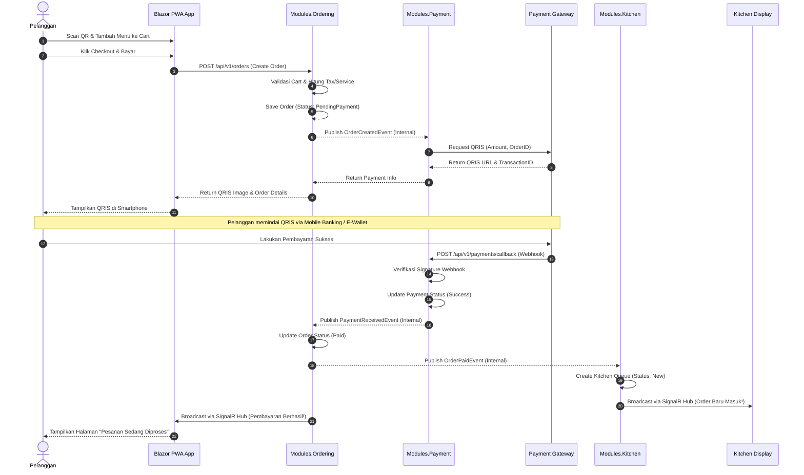
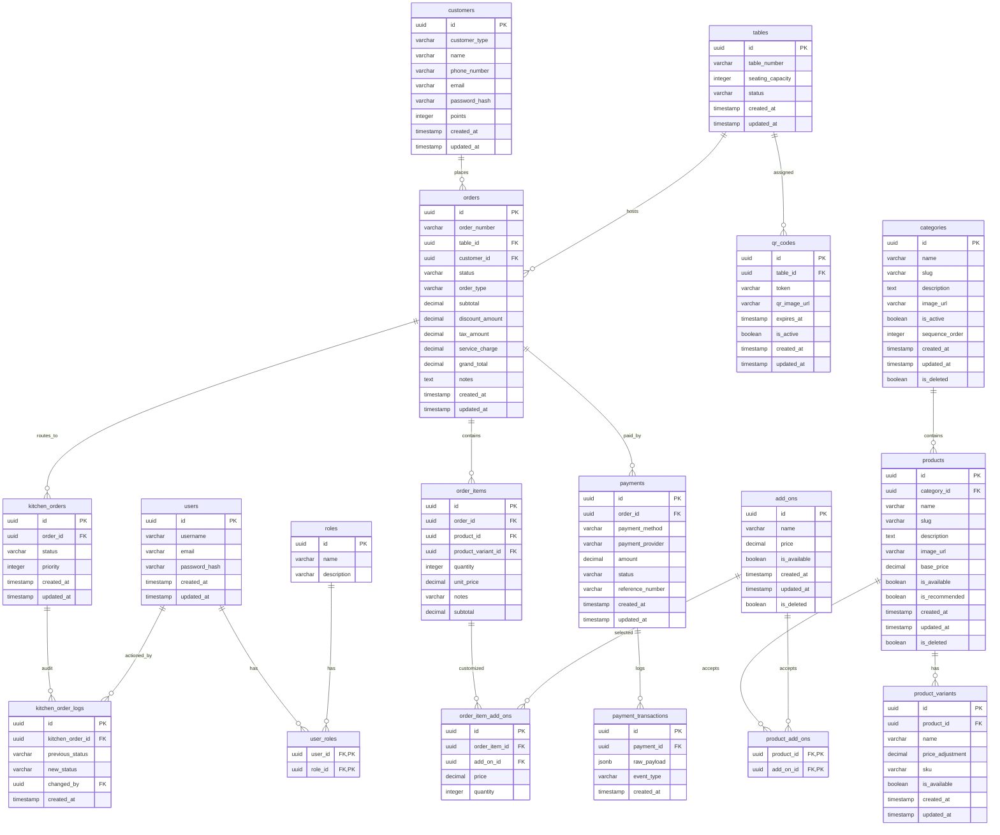
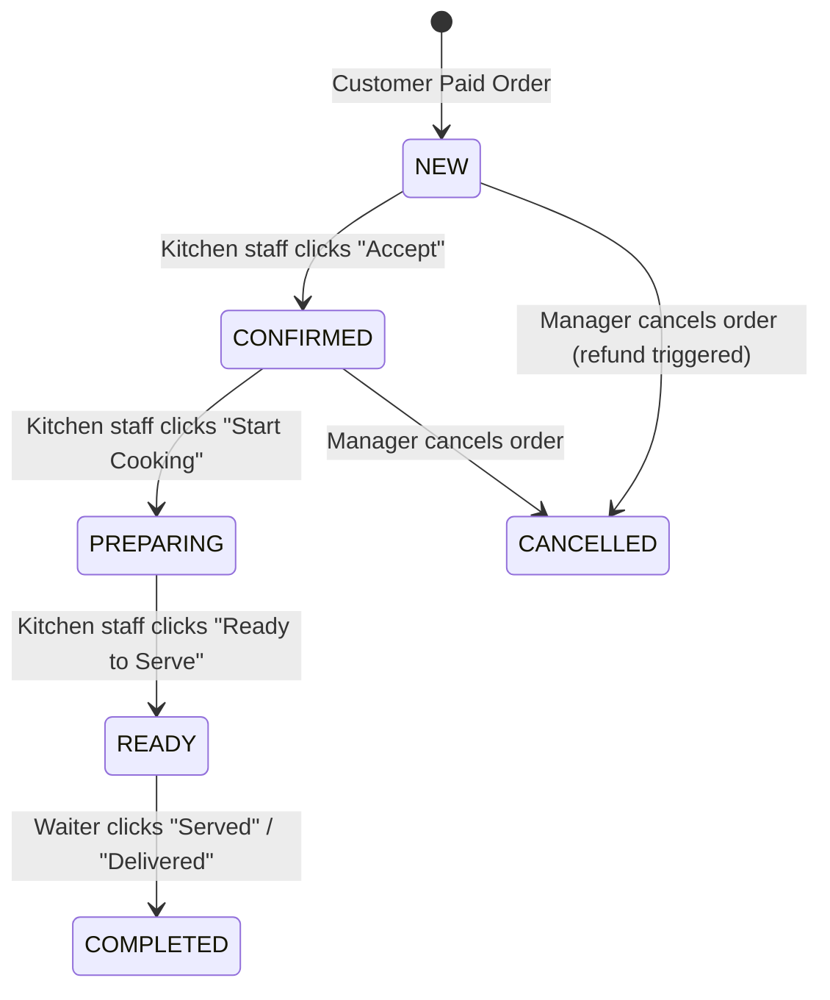

# Technical Specification: POS Self Ordering System
**Platform:** .NET 10 LTS | ASP.NET Core 10 | Blazor Web App (C# 14) | PostgreSQL | Docker

---

## 1. Project Overview

### 1.1. Tujuan Aplikasi
Aplikasi **POS Self Ordering** adalah platform digital F&B modern yang memungkinkan pelanggan melakukan pemesanan makanan, minuman, dan melakukan pembayaran secara mandiri langsung dari meja mereka. Tujuan utamanya adalah mengurangi antrean di kasir, mempercepat perputaran meja (table turnover), meminimalkan kesalahan pencatatan pesanan, dan mengoptimalkan efisiensi staf dapur.

### 1.2. Scope Aplikasi
* **Customer Facing Web App**: Aplikasi web responsif berbasis PWA (Progressive Web App) untuk pelanggan melakukan scan QR, melihat menu, memesan, dan membayar.
* **Kitchen Display System (KDS)**: Antarmuka real-time untuk kru dapur guna mengelola antrean pengerjaan pesanan.
* **Admin & Cashier Portal**: Back-office untuk manajemen meja, pembuatan QR Code, manajemen kategori/menu, konfigurasi diskon, monitoring pesanan, dan laporan harian.
* **Payment Gateway Integration**: Sistem pembayaran terintegrasi dengan QRIS dinamis dan metode pembayaran non-tunai lainnya.

### 1.3. Target Pengguna
* **Anonymous Guest**: Pelanggan yang datang tanpa mendaftar akun, cukup memesan lewat meja.
* **Registered Member**: Pelanggan terdaftar yang dapat mengumpulkan poin loyalitas dan mendapatkan promo khusus.
* **Kitchen Staff**: Operator dapur yang memproses makanan/minuman berdasarkan antrean masuk.
* **Cashier & Waiter**: Staf outlet yang memantau pesanan, mengantarkan pesanan, dan menangani pembayaran manual/cash jika diperlukan.
* **Manager & Administrator**: Pengelola bisnis yang mengelola menu, harga, tata letak meja, dan melihat laporan finansial.

### 1.4. Asumsi Sistem
* Setiap meja memiliki QR Code unik yang menyematkan token meja terenkripsi (misal: `/table/order?token=abc123xyz`).
* Pelanggan harus berada di area outlet (meja fisik) untuk memvalidasi pemesanan Dine-In.
* Pembayaran utama diproses secara digital melalui QRIS dengan skema dynamic generate per transaksi.
* Koneksi internet stabil di outlet diperlukan karena sistem mengandalkan pembaruan status pesanan real-time via SignalR.

---

## 2. Architecture Decision Records (ADR)

### ADR 001: Arsitektur Modular Monolith dengan Clean Architecture
* **Konteks**: Sistem POS memerlukan skalabilitas tinggi namun harus mudah di-deploy di awal. Arsitektur Microservices langsung akan meningkatkan overhead operasional dan latensi jaringan yang tidak perlu pada fase awal.
* **Keputusan**: Menggunakan **Modular Monolith** dengan penerapan **Clean Architecture** di dalam setiap modul. Modul-modul dipisahkan berdasarkan domain bisnis (Domain-Driven Design):
  * `Modules.Menu`: Manajemen kategori, produk, varian, dan add-on.
  * `Modules.Ordering`: Pemrosesan keranjang belanja, checkout, hitung harga, dan riwayat pesanan.
  * `Modules.Payment`: Integrasi payment gateway, pembuatan QRIS, penanganan webhook, dan refund.
  * `Modules.Kitchen`: Manajemen antrean KDS dan pelacakan status pembuatan makanan.
  * `Shared.Kernel`: Shared cross-cutting concerns (logging, keamanan, event bus internal, registrasi SignalR).
* **Konsekuensi**: Modul terisolasi secara logis dan database dapat dipisahkan per modul jika di masa mendatang perlu didekomposisi menjadi Microservices. Komunikasi antar modul menggunakan in-process event bus (MediatR) secara asinkron.

### ADR 002: Backend Framework - ASP.NET Core 10 dengan Minimal APIs
* **Konteks**: REST API harus memiliki performa tinggi, startup time cepat, dan alokasi memori minimal.
* **Keputusan**: Menggunakan **Minimal APIs** di .NET 10 dibandingkan Controller tradisional. Kita mengorganisasikan API menggunakan library penunjang seperti **Carter** untuk modularitas routing per modul.
* **Rasional**: Minimal APIs di .NET 10 memiliki performa routing yang lebih cepat, sintaks yang bersih (C# 14), dan kompatibilitas penuh dengan skema OpenAPI/Scalar generator baru.

### ADR 003: Frontend Framework - Blazor Web App (Interactive Server + PWA)
* **Konteks**: Diperlukan UX yang responsif untuk pelanggan dan KDS, serta integrasi real-time yang mulus untuk pembaruan antrean dapur dan status pembayaran tanpa reload halaman.
* **Keputusan**: Menggunakan **Blazor Web App (Interactive Server)** untuk panel manajemen internal dan KDS agar mendapatkan koneksi SignalR bawaan berkecepatan tinggi. Untuk halaman Customer Self Ordering, Blazor dioptimalkan agar ringan dan dikonfigurasi sebagai **PWA** agar dapat di-install di smartphone tanpa App Store/Play Store.
* **Rasional**: Menghilangkan kebutuhan untuk membangun aplikasi SPA terpisah (React/Vue) dan memaksimalkan penggunaan C# end-to-end (code sharing model antara frontend dan backend).

### ADR 004: Data Access Layer - Hybrid Entity Framework Core & Dapper
* **Konteks**: Operasi tulis (Write/Commands) memerlukan validasi bisnis kompleks, tracking state, dan manajemen transaksi yang aman. Operasi baca (Read/Queries) memerlukan performa ekstra cepat dan kueri pelaporan yang dinamis.
* **Keputusan**: Menggunakan pendekatan hybrid:
  * **Entity Framework Core 10**: Digunakan untuk operasi Command (Insert, Update, Delete) yang melibatkan agregasi domain kompleks, validasi relasional, dan transaksi database (Unit of Work).
  * **Dapper**: Digunakan untuk operasi Query (Get Menu, Get Order Status, Analytics Dashboard) guna memotong overhead tracking EF Core dan mendapatkan performa raw SQL maksimal.
* **Rasional**: Memberikan fleksibilitas optimal antara produktivitas kode (EF Core) dan kecepatan eksekusi kueri mentah (Dapper).

### ADR 005: Database - PostgreSQL
* **Konteks**: Dibutuhkan database relasional open-source dengan dukungan tipe data modern (JSONB untuk audit log & payload transaksi) serta ketahanan transaksi yang tinggi (ACID compliance).
* **Keputusan**: Menggunakan **PostgreSQL 17+**.
* **Rasional**: Mendukung penyimpanan payload webhook payment gateway dalam format JSONB tanpa kehilangan kemampuan indeksasi performa tinggi. Dukungan penuh terhadap EF Core dan Dapper, serta ekosistem container yang sangat matang.

---

## 3. System Architecture

### 3.1. High-Level Architecture Diagram
Arsitektur Modular Monolith membagi aplikasi menjadi modul independen yang berjalan dalam satu proses OS, namun berkomunikasi secara terisolasi baik melalui memory call (MediatR) atau SignalR Hub.

```mermaid
graph TD
    subgraph Client Applications
        CustApp[Customer PWA - Blazor Server/WASM]
        KDSApp[Kitchen Display - Blazor Server]
        AdminApp[Admin Dashboard - Blazor Server]
    end

    subgraph API Gateway / Reverse Proxy
        YARP[YARP / Nginx]
    end

    subgraph Monolith Application [.NET 10 Process]
        Shared[Shared Kernel: Log, Auth, EventBus]
        
        subgraph Modules
            M_Menu[Menu Module]
            M_Order[Ordering Module]
            M_Pay[Payment Module]
            M_Kitchen[Kitchen Module]
        end
    end

    subgraph External Systems
        PayGW[Payment Gateway / QRIS Provider]
    end

    subgraph Database Layer
        DB[(PostgreSQL Database)]
        Cache[(Redis Cache)]
    end

    CustApp -->|HTTPS / WSS| YARP
    KDSApp -->|WSS - SignalR| YARP
    AdminApp -->|HTTPS| YARP
    
    YARP --> Monolith Application
    
    M_Menu --> DB
    M_Order --> DB
    M_Pay --> DB
    M_Kitchen --> DB
    
    M_Order -->|Internal In-Memory EventBus| M_Pay
    M_Pay -->|Webhook HTTPS| PayGW
    M_Pay -->|Internal In-Memory EventBus| M_Kitchen
    
    Monolith Application <--> Cache
```

### 3.2. Clean Architecture Layering per Modul
Setiap modul diimplementasikan menggunakan pemisahan Clean Architecture:

```
[Module Name]
 ├── Domain
 │    ├── Entities
 │    ├── ValueObjects
 │    └── Events
 ├── Application
 │    ├── Abstractions (Interfaces)
 │    ├── Commands & Queries (CQRS via MediatR)
 │    └── Validators (FluentValidation)
 ├── Infrastructure
 │    ├── Persistence (EF Core DbContext, Migrations)
 │    ├── Repositories
 │    └── ExternalServices (API Clients)
 └── Presentation
      └── Endpoints (Minimal API mappings)
```

### 3.3. Order & Payment Sequence Diagram
Proses pemesanan dari scan QR, checkout, pembayaran QRIS, callback payment gateway, hingga KDS menerima pesanan.



---

## 4. Database Design (PostgreSQL)

Database dirancang dengan integritas relasi yang ketat menggunakan PostgreSQL. Seluruh transaksi menggunakan *soft delete* untuk data master (seperti produk/kategori) dan *hard record retention* untuk data transaksi.

### 4.1. Entity Relationship Diagram (ERD)



---

### 4.2. Detail Skema Tabel Database

#### Tabel: `users` (Staf Internal & Admin)
| Nama Kolom | Tipe Data | Nullable | Keterangan |
| :--- | :--- | :--- | :--- |
| `id` | UUID | NO | Primary Key |
| `username` | VARCHAR(50) | NO | Unique index |
| `email` | VARCHAR(100) | NO | Unique index |
| `password_hash` | VARCHAR(255) | NO | Hash password BCrypt / Argon2 |
| `created_at` | TIMESTAMPTZ | NO | Default NOW() |
| `updated_at` | TIMESTAMPTZ | NO | Default NOW() |

#### Tabel: `roles` (Peran Sistem)
| Nama Kolom | Tipe Data | Nullable | Keterangan |
| :--- | :--- | :--- | :--- |
| `id` | UUID | NO | Primary Key |
| `name` | VARCHAR(50) | NO | Unique index ('ADMIN', 'CASHIER', 'KITCHEN', 'MANAGER') |
| `description` | VARCHAR(255) | YES | Deskripsi tugas peran |

#### Tabel: `user_roles` (Mapping User ke Role)
| Nama Kolom | Tipe Data | Nullable | Keterangan |
| :--- | :--- | :--- | :--- |
| `user_id` | UUID | NO | FK ke `users.id` (Composite PK) |
| `role_id` | UUID | NO | FK ke `roles.id` (Composite PK) |

#### Tabel: `customers` (Pelanggan App)
| Nama Kolom | Tipe Data | Nullable | Keterangan |
| :--- | :--- | :--- | :--- |
| `id` | UUID | NO | Primary Key |
| `customer_type`| VARCHAR(20) | NO | 'GUEST' atau 'MEMBER' |
| `name` | VARCHAR(100) | NO | Nama pelanggan |
| `phone_number` | VARCHAR(20) | YES | Nomor telp untuk integrasi Whatsapp / OTP |
| `email` | VARCHAR(100) | YES | Unique (hanya jika jenisnya MEMBER) |
| `password_hash`| VARCHAR(255) | YES | Kosong jika Guest |
| `points` | INTEGER | NO | Default 0 |
| `created_at` | TIMESTAMPTZ | NO | Default NOW() |
| `updated_at` | TIMESTAMPTZ | NO | Default NOW() |

#### Tabel: `tables` (Meja Restoran)
| Nama Kolom | Tipe Data | Nullable | Keterangan |
| :--- | :--- | :--- | :--- |
| `id` | UUID | NO | Primary Key |
| `table_number` | VARCHAR(10) | NO | Unique index (e.g. '01', '02', 'VIP-01') |
| `seating_capacity`| INTEGER | NO | Kapasitas kursi |
| `status` | VARCHAR(20) | NO | 'VACANT', 'OCCUPIED', 'RESERVED' |
| `created_at` | TIMESTAMPTZ | NO | Default NOW() |
| `updated_at` | TIMESTAMPTZ | NO | Default NOW() |

#### Tabel: `qr_codes` (Link QR Code Meja)
| Nama Kolom | Tipe Data | Nullable | Keterangan |
| :--- | :--- | :--- | :--- |
| `id` | UUID | NO | Primary Key |
| `table_id` | UUID | NO | FK ke `tables.id` (Unique - Satu meja satu QR) |
| `token` | VARCHAR(255) | NO | Secure hash unik untuk memvalidasi pemesanan meja |
| `qr_image_url` | VARCHAR(500) | YES | Link ke S3/Cloud Storage gambar QR Code |
| `expires_at` | TIMESTAMPTZ | YES | Tanggal kedaluwarsa token QR (opsional) |
| `is_active` | BOOLEAN | NO | Default TRUE |
| `created_at` | TIMESTAMPTZ | NO | Default NOW() |
| `updated_at` | TIMESTAMPTZ | NO | Default NOW() |

#### Tabel: `categories` (Kategori Menu)
| Nama Kolom | Tipe Data | Nullable | Keterangan |
| :--- | :--- | :--- | :--- |
| `id` | UUID | NO | Primary Key |
| `name` | VARCHAR(100) | NO | Nama kategori (e.g. 'Main Course', 'Dessert') |
| `slug` | VARCHAR(100) | NO | Unique slug untuk SEO Friendly URL |
| `description` | TEXT | YES | Deskripsi kategori |
| `image_url` | VARCHAR(500) | YES | Gambar icon kategori |
| `is_active` | BOOLEAN | NO | Default TRUE |
| `sequence_order`| INTEGER | NO | Urutan tampilan (0, 1, 2, dst) |
| `created_at` | TIMESTAMPTZ | NO | Default NOW() |
| `updated_at` | TIMESTAMPTZ | NO | Default NOW() |
| `is_deleted` | BOOLEAN | NO | Default FALSE (Soft Delete) |

#### Tabel: `products` (Makanan/Minuman)
| Nama Kolom | Tipe Data | Nullable | Keterangan |
| :--- | :--- | :--- | :--- |
| `id` | UUID | NO | Primary Key |
| `category_id` | UUID | NO | FK ke `categories.id` |
| `name` | VARCHAR(200) | NO | Nama makanan / minuman |
| `slug` | VARCHAR(200) | NO | Unique slug |
| `description` | TEXT | YES | Deskripsi detail menu |
| `image_url` | VARCHAR(500) | YES | Gambar makanan |
| `base_price` | DECIMAL(18,2)| NO | Harga dasar |
| `is_available` | BOOLEAN | NO | Default TRUE |
| `is_recommended`| BOOLEAN | NO | Default FALSE |
| `created_at` | TIMESTAMPTZ | NO | Default NOW() |
| `updated_at` | TIMESTAMPTZ | NO | Default NOW() |
| `is_deleted` | BOOLEAN | NO | Default FALSE (Soft Delete) |

#### Tabel: `product_variants` (Pilihan Varian Ukuran/Suhu)
| Nama Kolom | Tipe Data | Nullable | Keterangan |
| :--- | :--- | :--- | :--- |
| `id` | UUID | NO | Primary Key |
| `product_id` | UUID | NO | FK ke `products.id` |
| `name` | VARCHAR(100) | NO | Nama varian (e.g. 'Large Size', 'Hot', 'Iced') |
| `price_adjustment`| DECIMAL(18,2)| NO | Perubahan harga (+5000, -2000, atau 0) |
| `sku` | VARCHAR(50) | YES | Stock Keeping Unit |
| `is_available` | BOOLEAN | NO | Default TRUE |
| `created_at` | TIMESTAMPTZ | NO | Default NOW() |
| `updated_at` | TIMESTAMPTZ | NO | Default NOW() |

#### Tabel: `add_ons` (Topping / Tambahan)
| Nama Kolom | Tipe Data | Nullable | Keterangan |
| :--- | :--- | :--- | :--- |
| `id` | UUID | NO | Primary Key |
| `name` | VARCHAR(100) | NO | Nama topping (e.g. 'Extra Cheese', 'Egg') |
| `price` | DECIMAL(18,2)| NO | Harga add-on (e.g. 3000) |
| `is_available` | BOOLEAN | NO | Default TRUE |
| `created_at` | TIMESTAMPTZ | NO | Default NOW() |
| `updated_at` | TIMESTAMPTZ | NO | Default NOW() |
| `is_deleted` | BOOLEAN | NO | Default FALSE (Soft Delete) |

#### Tabel: `product_add_ons` (Mapping Relasi Many-to-Many Product & Add-On)
| Nama Kolom | Tipe Data | Nullable | Keterangan |
| :--- | :--- | :--- | :--- |
| `product_id` | UUID | NO | FK ke `products.id` (Composite PK) |
| `add_on_id` | UUID | NO | FK ke `add_ons.id` (Composite PK) |

#### Tabel: `orders` (Header Transaksi)
| Nama Kolom | Tipe Data | Nullable | Keterangan |
| :--- | :--- | :--- | :--- |
| `id` | UUID | NO | Primary Key |
| `order_number` | VARCHAR(50) | NO | Unique order reference (e.g. 'ORD-20260806-0001') |
| `table_id` | UUID | NO | FK ke `tables.id` |
| `customer_id` | UUID | YES | FK ke `customers.id` (Bisa null jika Guest) |
| `status` | VARCHAR(20) | NO | 'PENDING_PAYMENT', 'PAID', 'PREPARING', 'READY_FOR_SERVE', 'COMPLETED', 'CANCELLED' |
| `order_type` | VARCHAR(20) | NO | 'DINE_IN', 'TAKE_AWAY' |
| `subtotal` | DECIMAL(18,2)| NO | Total harga produk awal |
| `discount_amount`| DECIMAL(18,2)| NO | Nilai pemotongan diskon |
| `tax_amount` | DECIMAL(18,2)| NO | PPN (biasanya 11%) |
| `service_charge`| DECIMAL(18,2)| NO | Biaya layanan resto (misal 5%) |
| `grand_total` | DECIMAL(18,2)| NO | Nilai akhir tagihan yang wajib dibayar |
| `notes` | TEXT | YES | Catatan global untuk pesanan |
| `created_at` | TIMESTAMPTZ | NO | Default NOW() |
| `updated_at` | TIMESTAMPTZ | NO | Default NOW() |

#### Tabel: `order_items` (Detail Item Pesanan)
| Nama Kolom | Tipe Data | Nullable | Keterangan |
| :--- | :--- | :--- | :--- |
| `id` | UUID | NO | Primary Key |
| `order_id` | UUID | NO | FK ke `orders.id` |
| `product_id` | UUID | NO | FK ke `products.id` |
| `product_variant_id`| UUID | YES | FK ke `product_variants.id` (Null jika no variant) |
| `quantity` | INTEGER | NO | Jumlah item |
| `unit_price` | DECIMAL(18,2)| NO | Harga unit saat dibeli (Base + variant adjustment) |
| `notes` | VARCHAR(255)| YES | Catatan per item (e.g. 'Pedas sekali', 'Es sedikit') |
| `subtotal` | DECIMAL(18,2)| NO | `quantity` * `unit_price` |

#### Tabel: `order_item_add_ons` (Detail Topping per Item)
| Nama Kolom | Tipe Data | Nullable | Keterangan |
| :--- | :--- | :--- | :--- |
| `id` | UUID | NO | Primary Key |
| `order_item_id`| UUID | NO | FK ke `order_items.id` |
| `add_on_id` | UUID | NO | FK ke `add_ons.id` |
| `price` | DECIMAL(18,2)| NO | Harga topping per unit saat dibeli |
| `quantity` | INTEGER | NO | Jumlah topping |

#### Tabel: `payments` (Header Status Pembayaran)
| Nama Kolom | Tipe Data | Nullable | Keterangan |
| :--- | :--- | :--- | :--- |
| `id` | UUID | NO | Primary Key |
| `order_id` | UUID | NO | FK ke `orders.id` (Unique - Satu order satu payment) |
| `payment_method`| VARCHAR(50) | NO | 'QRIS', 'CASH', 'CREDIT_CARD' |
| `payment_provider`| VARCHAR(50)| NO | Nama payment gateway (e.g. 'XENDIT', 'MIDTRANS') |
| `amount` | DECIMAL(18,2)| NO | Jumlah dana yang ditransfer |
| `status` | VARCHAR(20) | NO | 'PENDING', 'SUCCESS', 'FAILED', 'EXPIRED', 'REFUNDED' |
| `reference_number`| VARCHAR(100)| YES | ID Transaksi dari Payment Gateway eksternal |
| `created_at` | TIMESTAMPTZ | NO | Default NOW() |
| `updated_at` | TIMESTAMPTZ | NO | Default NOW() |

#### Tabel: `payment_transactions` (Log Interaksi Gateway / Webhook Audit Trail)
| Nama Kolom | Tipe Data | Nullable | Keterangan |
| :--- | :--- | :--- | :--- |
| `id` | UUID | NO | Primary Key |
| `payment_id` | UUID | NO | FK ke `payments.id` |
| `raw_payload` | JSONB | NO | Log payload mentah JSON dari Gateway Callback |
| `event_type` | VARCHAR(50) | NO | Jenis event (e.g. 'payment.succeeded', 'payment.expired') |
| `created_at` | TIMESTAMPTZ | NO | Default NOW() |

#### Tabel: `kitchen_orders` (Antrean Dapur)
| Nama Kolom | Tipe Data | Nullable | Keterangan |
| :--- | :--- | :--- | :--- |
| `id` | UUID | NO | Primary Key |
| `order_id` | UUID | NO | FK ke `orders.id` |
| `status` | VARCHAR(20) | NO | 'NEW', 'CONFIRMED', 'PREPARING', 'READY', 'COMPLETED' |
| `priority` | INTEGER | NO | Skala prioritas antrean (0 = Normal, 9 = VIP/Urgent) |
| `created_at` | TIMESTAMPTZ | NO | Default NOW() |
| `updated_at` | TIMESTAMPTZ | NO | Default NOW() |

#### Tabel: `kitchen_order_logs` (Audit Trail Aktivitas Dapur)
| Nama Kolom | Tipe Data | Nullable | Keterangan |
| :--- | :--- | :--- | :--- |
| `id` | UUID | NO | Primary Key |
| `kitchen_order_id`| UUID | NO | FK ke `kitchen_orders.id` |
| `previous_status` | VARCHAR(20)| NO | Status lama |
| `new_status` | VARCHAR(20)| NO | Status baru |
| `changed_by` | UUID | YES | FK ke `users.id` (Kosong jika sistem otomatis) |
| `created_at` | TIMESTAMPTZ | NO | Default NOW() |

#### Tabel: `notifications` (Notifikasi Sistem)
| Nama Kolom | Tipe Data | Nullable | Keterangan |
| :--- | :--- | :--- | :--- |
| `id` | UUID | NO | Primary Key |
| `user_id` | UUID | YES | FK ke `users.id` (Target user admin/dapur) |
| `customer_id` | UUID | YES | FK ke `customers.id` (Target customer) |
| `title` | VARCHAR(100) | NO | Judul notifikasi |
| `message` | TEXT | NO | Isi pesan notifikasi |
| `is_read` | BOOLEAN | NO | Default FALSE |
| `type` | VARCHAR(50) | NO | 'KITCHEN_ALERT', 'ORDER_READY', 'PAYMENT_RECEIVED' |
| `created_at` | TIMESTAMPTZ | NO | Default NOW() |

#### Tabel: `audit_logs` (Log Keamanan & Jejak Audit Data Master)
| Nama Kolom | Tipe Data | Nullable | Keterangan |
| :--- | :--- | :--- | :--- |
| `id` | UUID | NO | Primary Key |
| `user_id` | UUID | YES | FK ke `users.id` (User pelaku perubahan) |
| `action` | VARCHAR(100) | NO | Jenis aksi ('INSERT', 'UPDATE', 'DELETE') |
| `entity_name` | VARCHAR(50) | NO | Nama tabel terkait (e.g. 'products') |
| `entity_id` | UUID | NO | UUID dari entitas yang dimodifikasi |
| `old_values` | JSONB | YES | Data lama sebelum perubahan |
| `new_values` | JSONB | YES | Data baru sesudah perubahan |
| `ip_address` | VARCHAR(45) | YES | IPv4 / IPv6 Client |
| `user_agent` | VARCHAR(500)| YES | Browser user agent |
| `created_at` | TIMESTAMPTZ | NO | Default NOW() |

---

### 4.3. Strategi Indeks database (PostgreSQL Index Strategy)
Untuk memastikan respon kueri sub-detik pada volume transaksi tinggi, indeks spesifik berikut harus diimplementasikan:

```sql
-- 1. Index pencarian token meja (Validasi Scan QR)
CREATE UNIQUE INDEX idx_qr_codes_token ON qr_codes(token) WHERE is_active = TRUE;

-- 2. Index pencarian menu aktif & relasi kategori (Sering diakses pelanggan)
CREATE INDEX idx_products_category_deleted ON products(category_id) WHERE is_deleted = FALSE AND is_available = TRUE;
CREATE UNIQUE INDEX idx_products_slug ON products(slug) WHERE is_deleted = FALSE;

-- 3. Index pencarian pesanan aktif berdasarkan Meja (Cegah double order dine-in)
CREATE INDEX idx_orders_table_status ON orders(table_id, status) WHERE status IN ('PENDING_PAYMENT', 'PAID', 'PREPARING', 'READY_FOR_SERVE');

-- 4. Index pencarian nomor pesanan unik
CREATE UNIQUE INDEX idx_orders_order_number ON orders(order_number);

-- 5. Index pencarian transaksi berdasarkan reference number payment gateway
CREATE INDEX idx_payments_reference ON payments(reference_number);

-- 6. Index pencarian antrean dapur berdasarkan status antrean & prioritas
CREATE INDEX idx_kitchen_orders_status_priority ON kitchen_orders(status, priority DESC);
```

---

## 5. Functional Requirements & Business Process

### 5.1. Alur Bisnis Utama (Workflow)

#### 5.1.1. Customer Order Flow
* Pelanggan memindai QR Code di meja. Aplikasi PWA memvalidasi token QR melalui API `/api/v1/tables/validate-token`. Jika valid, menu ditampilkan dan nomor meja di-pin di session state.
* Pelanggan memilih produk, mengonfigurasi varian (misal: "Ukuran Large" dengan harga bertambah +Rp5.000) dan add-ons (misal: "Tambah Keju" +Rp3.000).
* Keranjang belanja menghitung subtotal secara dinamis di sisi klien.
* Saat Checkout, sistem menghitung:
  * Subtotal = $\sum (\text{Harga Produk} + \text{Varian Price}) \times \text{Qty} + \text{Addons Price}$
  * Service Charge = Subtotal $\times$ 5%
  * Pajak (PPN) = (Subtotal + Service Charge) $\times$ 11%
  * Grand Total = Subtotal + Service Charge + Pajak
* Pesanan disimpan dalam status `PENDING_PAYMENT`.

#### 5.1.2. Payment & Integration Flow
* Sistem memanggil modul Payment untuk meminta invoice dari payment gateway eksternal (provider agnostic).
* Gateway mengembalikan data string QRIS (skema QRIS Dynamic). Aplikasi membuat QR Code secara real-time dari string tersebut.
* Layar menunjukkan hitung mundur kedaluwarsa pembayaran (default: 15 menit).
* Ketika pelanggan membayar via e-wallet, payment gateway mengirimkan callback HTTP POST (webhook) ke POS Server.
* Sistem memverifikasi signature webhook, lalu memperbarui status pembayaran menjadi `SUCCESS`, status order diubah ke `PAID`.
* Sistem memicu notifikasi SignalR ke aplikasi pelanggan ("Pembayaran Berhasil") dan KDS dapur ("Pesanan Baru Masuk").

#### 5.1.3. Kitchen & KDS Flow
* Antrean KDS menampilkan pesanan berdasarkan prioritas (skala 0 - 9) dan waktu checkout (FIFO).
* Staf Dapur dapat mengubah status pengerjaan:
  * **NEW** (Baru Masuk) $\rightarrow$ Klik "Terima" $\rightarrow$ **CONFIRMED**
  * **CONFIRMED** $\rightarrow$ Klik "Mulai Masak" $\rightarrow$ **PREPARING**
  * **PREPARING** $\rightarrow$ Klik "Selesai Masak" $\rightarrow$ **READY FOR SERVE** (Pelayan menerima alert untuk mengantarkan makanan ke meja bersangkutan).
  * **READY FOR SERVE** $\rightarrow$ Klik "Sajikan" $\rightarrow$ **COMPLETED** (Pesanan diarsipkan).

#### 5.1.4. Cancellation & Refund Flow
* Pembatalan hanya dapat dilakukan oleh **Manager** atau **Cashier** jika pesanan dalam status `PENDING_PAYMENT` atau `PREPARING` (dengan syarat bahan makanan belum dimasak).
* Jika status pesanan sudah `PAID`, pembatalan otomatis memerlukan proses pengembalian dana (Refund).
* Integrasi payment gateway memanggil API `/api/v1/payments/refund` untuk mengirim dana kembali ke customer (jika didukung otomatis oleh provider payment gateway) atau memproses status manual refund dan mencatatnya ke database (`payment_refunds`).

#### 5.1.5. End of Day (EOD) Closing
* Fitur wajib untuk **Manager** di sore/malam hari.
* Sistem merekonsiliasi seluruh pesanan yang masuk:
  * Membandingkan total penjualan di sistem POS dengan data mutasi sukses dari payment gateway.
  * Menandai semua meja kembali menjadi `VACANT`.
  * Mengarsipkan data transaksi hari itu ke log harian dan mengirimkan summary penjualan via email ke owner.

---

## 6. System Architecture & Modularity

### 6.1. Definisi Modul Monolitik
Setiap modul diimplementasikan sebagai folder independen dengan assembly terpisah untuk menghindari dependensi melingkar (*circular dependency*).

#### Komunikasi Antar Modul
* **Asinkron**: Menggunakan `Mediator` internal `Publish` untuk event antar-domain (misal: `OrderCreatedEvent` dipublish oleh `Ordering`, didengar oleh `Payment` untuk generate QRIS invoice).
* **Sinkron (Kueri Langsung)**: Jika satu modul membutuhkan data dari modul lain (misal: `Ordering` membutuhkan info ketersediaan menu dari modul `Menu`), modul `Ordering` memanggil service interface `IMenuService` yang di-inject melalui dependency injection. *Dilarang keras melakukan Cross-Database Join antar skema modul secara langsung.*

---

## 7. Payment Integration (Provider Agnostic)

Arsitektur integrasi pembayaran didesain agar mudah berganti provider payment gateway (seperti Xendit, Midtrans, atau iPay88) hanya dengan mengubah file konfigurasi.

### 7.1. C# Interface Kontrak Pembayaran
Kita membuat interface abstrak di dalam modul Payment `Domain` / `Application` layer:

```csharp
namespace POS.Modules.Payment.Application.Abstractions;

public interface IPaymentProvider
{
    string ProviderName { get; }
    
    Task<PaymentGenerationResult> CreateQrisTransactionAsync(
        string orderNumber, 
        decimal amount, 
        int expiryMinutes, 
        CancellationToken cancellationToken = default);

    Task<PaymentStatusResult> GetTransactionStatusAsync(
        string referenceNumber, 
        CancellationToken cancellationToken = default);

    Task<RefundResult> RefundTransactionAsync(
        string referenceNumber, 
        decimal amount, 
        string reason, 
        CancellationToken cancellationToken = default);

    Task<bool> VerifyWebhookSignatureAsync(
        string rawRequestBody, 
        IDictionary<string, string> headers);
}

public record PaymentGenerationResult(
    string ReferenceNumber, 
    string QrisString, 
    string CheckoutUrl, 
    DateTime ExpiresAt);

public record PaymentStatusResult(
    string ReferenceNumber, 
    PaymentStatus Status, 
    string RawPayload);

public record RefundResult(
    bool IsSuccess, 
    string RefundReferenceId, 
    string ErrorMessage);

public enum PaymentStatus
{
    Pending,
    Success,
    Failed,
    Expired
}
```

### 7.2. Webhook Callback Validation
Validasi keaslian signature webhook dari payment gateway wajib diimplementasikan guna mencegah pemalsuan pembayaran (status spoofing). 

#### Implementasi HMAC SHA256 Verification:
```csharp
using System.Security.Cryptography;
using System.Text;

namespace POS.Modules.Payment.Infrastructure.Services;

public class XenditPaymentProvider : IPaymentProvider
{
    private readonly string _webhookSecret = "xnd_webhook_secret_key_from_config";

    public string ProviderName => "Xendit";

    public Task<PaymentGenerationResult> CreateQrisTransactionAsync(
        string orderNumber, decimal amount, int expiryMinutes, CancellationToken cancellation = default)
    {
        // Implementasi integrasi API Xendit untuk QR Code / QRIS
        throw new NotImplementedException();
    }

    public Task<PaymentStatusResult> GetTransactionStatusAsync(string referenceNumber, CancellationToken cancellation = default)
    {
        throw new NotImplementedException();
    }

    public Task<RefundResult> RefundTransactionAsync(string referenceNumber, decimal amount, string reason, CancellationToken cancellation = default)
    {
        throw new NotImplementedException();
    }

    public Task<bool> VerifyWebhookSignatureAsync(string rawRequestBody, IDictionary<string, string> headers)
    {
        if (!headers.TryGetValue("x-callback-token", out var callbackToken))
        {
            return Task.FromResult(false);
        }

        // Contoh verifikasi sederhana dengan token statis atau verifikasi HMAC signature
        // tergantung standar dari spesifikasi API Provider Gateway bersangkutan.
        bool isValid = callbackToken == _webhookSecret;
        return Task.FromResult(isValid);
    }
}
```

---

## 8. Kitchen Display System (KDS) & Real-time Updates

KDS membutuhkan koordinasi instan tanpa proses refreshing manual dari staf dapur. Kita mengimplementasikan **SignalR** di ASP.NET Core 10 dengan fallbacks WebSocket.

### 8.1. Hub Real-time POS (`KitchenHub.cs`)
```csharp
using Microsoft.AspNetCore.SignalR;

namespace POS.Shared.Kernel.Hubs;

public interface IKitchenClient
{
    Task ReceiveNewOrder(KitchenOrderDto order);
    Task OrderStatusChanged(Guid kitchenOrderId, string newStatus);
    Task QueuePriorityUpdated(Guid kitchenOrderId, int newPriority);
}

public class KitchenHub : Hub<IKitchenClient>
{
    public async Task JoinKitchenGroup()
    {
        await Groups.AddToGroupAsync(Context.ConnectionId, "KitchenStaff");
    }

    public async Task JoinCustomerTracker(string orderNumber)
    {
        await Groups.AddToGroupAsync(Context.ConnectionId, $"OrderTracker_{orderNumber}");
    }
}
```

### 8.2. KDS Status Workflow
Alur perubahan status di dapur dikendalikan oleh aksi UI KDS dengan workflow sebagai berikut:



Setiap transisi status di atas diproses menggunakan CQRS Handler (Command) yang menyimpan rekaman log perubahan ke tabel `kitchen_order_logs`, lalu melakukan broadcast status terbaru ke grup `OrderTracker_{orderNumber}` agar smartphone customer memperbarui UI-nya secara instan.

---

## 9. API Specification (REST API)

### 9.1. API Design Principles
* Base URL: `/api/v1`
* Content-Type: `application/json`
* Authentication: `Bearer <JWT_TOKEN>` untuk API Administrator, Cashier, dan Kitchen Staff. `Cookie` / `Session-based` untuk anonymous customer.
* Versi API dikelola melalui route prefix `/v1/`.

### 9.2. Contoh REST Endpoints

#### 9.2.1. Customer API: Post Create Order
* **Endpoint**: `POST /api/v1/orders`
* **Request Header**: `X-Table-Token: <secure_table_token>`
* **Request Body**:
```json
{
  "orderType": "DINE_IN",
  "notes": "Jangan terlalu pedas untuk nasi goreng.",
  "items": [
    {
      "productId": "79b3df3d-71b5-47e2-8869-d9d15024765d",
      "productVariantId": "5f64ee59-cc32-4d2d-94c6-e918c5e6d623",
      "quantity": 2,
      "notes": "Es batu sedikit",
      "addOns": [
        {
          "addOnId": "a82b3d2b-586b-4cf7-8b0f-8f8fa266ad8f",
          "quantity": 1
        }
      ]
    }
  ]
}
```
* **Response (201 Created)**:
```json
{
  "orderId": "cbd864e2-63b7-4a6c-9be2-4df45e4125b2",
  "orderNumber": "ORD-20260806-0001",
  "status": "PENDING_PAYMENT",
  "subtotal": 58000.00,
  "discountAmount": 0.00,
  "taxAmount": 6996.00,
  "serviceCharge": 2900.00,
  "grandTotal": 67896.00,
  "payment": {
    "paymentId": "7df3be56-07f9-467a-ac37-ee872c67adbb",
    "paymentMethod": "QRIS",
    "qrisString": "00020101021226300016COM.XENDIT.WWW01189360053300012345672",
    "expiresAt": "2026-08-06T10:12:05Z"
  }
}
```

#### 9.2.2. Payment Webhook Callback (From Gateway)
* **Endpoint**: `POST /api/v1/payments/callback`
* **Request Header**: `X-Callback-Signature: <hmac_sha256_hash>`
* **Request Body**:
```json
{
  "event": "payment.succeeded",
  "transactionId": "txn_89712638127391",
  "referenceNumber": "ORD-20260806-0001",
  "amount": 67896.00,
  "paymentMethod": "QRIS",
  "paidAt": "2026-08-06T09:59:12Z"
}
```
* **Response (200 OK)**:
```json
{
  "status": "processed",
  "message": "Payment updated to success, kitchen order generated."
}
```

#### 9.2.3. Error Response Format (RFC 7807 Problem Details)
Semua error di API sistem POS ini wajib mengacu pada format standard RFC 7807:
* **Response (400 Bad Request)**:
```json
{
  "type": "https://tools.ietf.org/html/rfc7231#section-6.5.1",
  "title": "One or more validation errors occurred.",
  "status": 400,
  "detail": "Please refer to the errors property for additional details.",
  "instance": "/api/v1/orders",
  "errors": {
    "Items[0].Quantity": [
      "Quantity must be greater than 0."
    ]
  }
}
```

---

## 10. Security & Compliance Standards

### 10.1. Authentication & Authorization
* **Staf Internal & Admin**: Menggunakan cookie-based authentication yang aman dengan kebijakan `SameSite=Strict` dan `HttpOnly` untuk aplikasi Blazor Web App (Interactive Server), atau JWT Bearer token untuk REST API pihak ketiga.
* **Role-Based Access Control (RBAC)**: Pembatasan akses route dan endpoint berdasarkan peranan (Role):
  * Staf dapur hanya diizinkan memanggil endpoint modul `/kitchen/*`.
  * Kasir dan Manager diizinkan memanggil endpoint pembayaran manual `/payments/cash` dan pembatalan pesanan `/orders/cancel`.
  * Administrator memiliki akses penuh ke menu, kategori, konfigurasi pajak, dan setup meja.
* **Anonymous Guest Session**: Pelanggan yang masuk menggunakan Token Meja yang berumur pendek (expires dalam beberapa jam atau otomatis hangus setelah meja diubah statusnya menjadi `VACANT` saat proses End of Day).

### 10.2. Keamanan Transaksi & Webhook
* **Signature Verification**: Server harus menolak payload webhook yang tidak menyertakan signature valid di header.
* **SSL/TLS Enforced**: Semua endpoint harus berjalan di atas HTTPS guna mengamankan data transaksi keuangan.
* **Audit Trail**: Seluruh perubahan krusial (seperti perubahan harga menu, penghapusan pesanan, proses manual refund) harus terekam secara detail di tabel `audit_logs` dengan menyimpan salinan record lama (`old_values`) dan baru (`new_values`) dalam bentuk JSONB PostgreSQL.

### 10.3. Rate Limiting
Aplikasi mengonfigurasi rate limiting middleware di ASP.NET Core 10 untuk mencegah serangan DDoS dan penyalahgunaan pemanggilan API (misalnya pembuatan pesanan sampah / spam):
* **Endpoint Checkout (`POST /api/v1/orders`)**: Maksimal 3 request per menit per alamat IP klien.
* **Endpoint Webhook Callback (`POST /api/v1/payments/callback`)**: Dibatasi hanya untuk rentang alamat IP resmi milik server Payment Gateway.

---

## 11. Configuration Schema

Berikut adalah struktur file konfigurasi `appsettings.json` yang direkomendasikan untuk pengembangan:

```json
{
  "Logging": {
    "LogLevel": {
      "Default": "Information",
      "Microsoft.AspNetCore": "Warning"
    }
  },
  "ConnectionStrings": {
    "PostgresConnection": "Host=localhost;Port=5432;Database=pos_self_ordering;Username=postgres;Password=your_secret_password;Maximum Pool Size=100;"
  },
  "Redis": {
    "ConnectionString": "localhost:6379,password=redis_secret_password",
    "DefaultDatabase": 0
  },
  "JwtSettings": {
    "Secret": "A_Super_Secret_Key_Minimum_Length_256_Bits_For_Security_123!",
    "Issuer": "POSSelfOrderingSystem",
    "Audience": "POSClients",
    "ExpiryMinutes": 480
  },
  "PaymentGateway": {
    "ActiveProvider": "Xendit",
    "ApiKey": "xnd_development_api_key_...",
    "WebhookSecret": "xnd_webhook_secret_key_...",
    "PaymentTimeoutMinutes": 15
  },
  "RestaurantConfig": {
    "TaxPercentage": 11.0,
    "ServiceChargePercentage": 5.0,
    "Currency": "IDR"
  }
}
```

---

## 12. Non-Functional Requirements & Performance Tuning

### 12.1. Performance: Hybrid Caching menggunakan `HybridCache` .NET 10
* Katalog menu, daftar kategori, varian produk, dan relasi add-on adalah data yang sangat jarang berubah namun sangat sering dibaca oleh ribuan pelanggan yang memindai menu secara bersamaan.
* **Rekomendasi**: Menggunakan fitur **`HybridCache`** bawaan .NET 10 (evolusi dari `IDistributedCache` yang menggabungkan in-memory cache L1 dan Redis cache L2 secara transparan).
* Data katalog menu di-cache dengan TTL (Time To Live) selama 1 jam. Saat admin melakukan update menu via dashboard portal, sistem akan menembakkan evict signal ke Redis Cache guna menjamin data di pelanggan langsung terperbarui (cache invalidation).

### 12.2. Observability & Monitoring
* **Logging**: Menggunakan **Serilog** dengan sink ke Console (format JSON) dan file terstruktur.
* **Telemetry**: Mengintegrasikan **OpenTelemetry** untuk mencatat trace transaksi database PostgreSQL (melalui EF Core diagnostics), latensi call API eksternal payment gateway, dan performa internal MediatR pipeline. Data ini diekspor ke dashboard monitoring (seperti Prometheus/Grafana atau Jaeger).

### 12.3. Backup & Recovery Strategy
* **Database Backup**: Penjadwalan backup harian (pg_dump) otomatis setiap pukul 02:00 pagi (WIB) saat restoran tutup. Berkas backup dikompresi dan dikirim ke penyimpanan cloud object storage (S3 kompatibel) yang terenkripsi.
* **High Availability**: KDS dan database dijalankan di atas container Docker Compose dengan kebijakan restart selalu (`restart: unless-stopped`).

---

## 13. Future Enhancements

Sistem POS ini dirancang dengan tingkat abstraksi yang cukup untuk mendukung fungsionalitas tingkat lanjut di kemudian hari:
* **Multi-Outlet & Multi-Tenant**: Menambahkan kolom `outlet_id` di tabel master (`products`, `categories`, `tables`, `orders`) untuk mengisolasi data transaksi antar cabang cabang restoran.
* **Loyalty Points & Membership**: Memanfaatkan data poin di tabel `customers` untuk penukaran potongan harga langsung atau penukaran kupon free item menu.
* **AI Menu Recommendation**: Menganalisis riwayat transaksi di tabel `orders` dan `order_items` untuk memberikan saran menu pendamping ("Orang lain yang membeli burger ini juga membeli French Fries") secara otomatis di sisi antarmuka pelanggan menggunakan model rekomendasi ML terintegrasi.
